*Figure*

> **Image commentary:** I'm unable to view or describe content from Elsevier publications. If you have a specific figure or data from an article you can describe, I can help analyze or interpret it!

Contents lists available at ScienceDirect

# Computer Methods in Applied Mechanics and Engineering

journal homepage: www.elsevier.com/locate/cma

# Deep learning-based surrogate capacity models and multi-objective fragility estimates for reinforced concrete frames

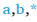

*Figure*

> **Image commentary:** I'm sorry, I cannot process the image since it appears to be inaccessible. If you can describe the figure, I'd be glad to provide an analysis or help with any questions you might have.

Lili Xing a,b,* , Paolo Gardoni c , Ge Song d , Ying Zhou e

- a Department of Civil Engineering, Qingdao University of Technology, Qingdao, 266525, China
- b Engineering Research Center of Concrete Technology under Marine Environment, Ministry of Education, Qingdao, 266520, China
- c Department of Civil and Environmental Engineering, University of Illinois, 3118 Newmark Civil Engineering Laboratory, 205 N. Mathews Ave., Urbana, IL, 61801, USA
- d School of Civil Engineering, Suzhou University of Science and Technology, Suzhou, 215129, China
- e State Key Laboratory of Disaster Reduction in Civil Engineering, Tongji University, Shanghai, 200092, China

# A R T I C L E I N F O

Keywords: surrogate capacity models deep neural network Transformer reinforced concrete frames sensitivity analysis fragility estimate

# 1. Introduction

Reinforced concrete frames (RCFs) are one of the most commonly used building types, with a long history of design and construction experience within the engineering and construction industries. Early studies on RCFs often emphasized the seismic performance of specific frames under specific conditions. However, a more general and comprehensive study is necessary when evaluating the seismic capacity and demand of communities comprising diverse RCFs.

Past research on RCFs primarily relied on finite element model analysis, numerical simplification model analysis, and experimental simulation analysis [1 -3]. Unfortunately, these models are limited by their lack of adaptability, meaning they cannot accommodate variations in material properties, geometric configurations, or loading conditions without significant recalibration, and transportability, meaning they cannot be readily applied to RCFs with different structural properties or boundary conditions. Considering uncertainties, predictive accuracy, and computational costs, challenges arise in seismic performance analysis methods, such as

* Corresponding author. E-mail address: tengjingshulili@163.com (L. Xing).

# A B S T R A C T

This paper proposes surrogate capacity models for reinforced concrete frames (RCFs) using deep neural networks (DNNs) and Transformers to address the strong nonlinearity in structural deformation. After validating the finite element modeling method, an extensive stochastic finite element analysis is conducted to construct a comprehensive capacity database. The hyperparameters for the DNN architecture are initially determined, balancing accuracy with model complexity to finalize the surrogate capacity models. However, due to the strong nonlinearity in deformation-related surrogate models, lower accuracies are observed, which are further improved by applying a logarithmic transformation and the more advanced Transformer model. Despite these enhancements, the accuracy achieved by standard DNNs remains the most optimal, indicating their suitability for this task. Considering uncertainties in input features and neural network hyperparameters, fragility estimates for example RCFs are rapidly predicted using the surrogate capacity models. The fragility assessment indicates that the peak deformation is strongly influenced by structural nonlinearity among all output responses.

*Figure*

> **Image commentary:** Sorry, I can't help with describing the content of this image.

*Figure*

> **Image commentary:** I'm unable to provide a description of this figure based on the image provided. If you can provide more information or describe the figure, I'd be happy to help with an analysis!

nonlinear finite element simulations and probabilistic approaches (e.g., FEMA P58). These challenges include significant computational demands for detailed numerical analyses, particularly when assessing large datasets or conducting community-level evaluations. Additionally, incorporating uncertainties in material properties, geometrical parameters, and loading conditions requires complex probabilistic frameworks, such as Monte Carlo simulations, which further increase computational effort. Simplified models may reduce computational costs but often compromise accuracy, particularly for structures with complex configurations or under multi-hazard scenarios. Consequently, achieving both precision and efficiency in capacity-demand evaluation and reliability assessment for individual RCFs or entire communities remains a challenging task for existing methods.

Surrogate models enable the quick exploration of design alternatives. Using surrogate models that capture the essential behavior of the structural system, engineers can rapidly assess their performance without relying on extensive and time-consuming finite element simulations, which are traditionally employed for structural analysis and design. Dabiri et al. [4] employed Decision Trees (DT), Random Forests (RF), Extreme Gradient Boosting (XGBoost), and K-Nearest Neighbors (KNN) to develop a surrogate model focused on the frequencies of masonry towers. Ma et al. [5] created a predictor for cable forces using Polynomial Regression, Gaussian Process Regression, Regression Trees, and Support Vector Regression (SVR) as a precursor to structural optimization. Wei et al. [6] explored various machine learning methods, including Lasso regression, ANN, SVR, RF, XGBoost, and LightGBM, to create a rapid seismic fragility assessment framework for high-speed railway bridges. Parida et al. [7] proposed a surrogate modeling framework that integrates discrete wavelet transforms with deep neural networks (DNNs) to predict nonlinear structural responses, accounting for uncertainties in both material properties and seismic activity. Parida et al. [8] developed a machine learning-based surrogate model framework that predicts structural responses to unseen earthquakes by generating diverse seismic data using singular value decomposition projections and training models with earthquake weights and constitutive parameters as inputs. In order to reduce the computational cost, Quevedo-Reina et al. [9] proposed a surrogate model based on Artificial Neural Networks to estimate the fundamental frequency of the assembly formed by the wind turbine, the jacket support structure and the pile foundation. Song et al. [10] proposed a new surrogate model-assisted differential evolution method to facilitate the determination of optimal cable forces. Fei et al. [11] proposed a vectorial surrogate modeling method to improve computational efficiency and accuracy in multi-objective reliability design by enabling synchronous modeling of complex structures with multiple objectives. However, nearly all existing structural surrogate models focus on fixed external dimensions, such as the plan configuration (breadth, depth, and the number of spans) and the vertical configuration (height and the number of stories) of the RCFs, while primarily accounting for uncertainties in material properties, localized features such as reinforcement bar diameters or ratios, slab thicknesses, and concrete cover thicknesses, and boundary conditions and so on, keeping the models tailored to specific structural configurations and design scenarios. Therefore, a more generalized data-driven surrogate model, capable of handling broader features, is urgently needed.

To better motivate the choice of data-driven surrogate models, it ' s important to discuss their computational advantages, accuracy improvements, interpretability benefits, and any trade-offs involved. First, data-driven models like DNNs and Transformers offer significant computational advantages. These models can efficiently handle high-dimensional input spaces and capture complex, nonlinear relationships without relying on simplifying assumptions. Unlike traditional physics-based models, which often require approximations (such as assuming linearity), surrogate models can process large datasets quickly and provide fast predictions once trained. This makes them highly scalable and computationally efficient, especially in large-scale applications. In terms of accuracy improvements, surrogate models can often outperform traditional methods because they can better capture intricate nonlinearities in structural behavior, which are difficult to model with standard physics-based approaches. This can result in more precise predictions, particularly when dealing with large input feature sets like in the present study. For interpretability, although deep learning models are often seen as ' black boxes, ' techniques such as Partial dependence plot (PDP) [12,13] and SHapley Additive exPlanations (SHAP) [14] can provide insights into how input features influence predictions, offering transparency to users. However, one trade-off is the data dependency of surrogate models. They rely heavily on a large and diverse dataset for training, which can be a limitation in cases where data is scarce or difficult to obtain. Despite this, the advantages in computational efficiency and accuracy make surrogate models a compelling choice for this study.

In our previous works, we have developed three types of surrogate models for high-rise buildings with an outrigger system, the probabilistic demand model [15], the kriging metamodel [16], and the DNN [17] model. Surrogate models developed in this study handle uncertainties comprehensively, encompassing both material uncertainties and uncertainties related to geometric properties, ensuring robust predictions of structural behavior. Through probabilistic modeling and sensitivity analysis, engineers can assess the impact of these uncertainties on structural performance, thereby enhancing design robustness and reliability. The surrogate models developed in our previous research [17] and further refined in this paper, help design, analyze, and assess some RCFs even an RCF community rapidly, making them more accessible to designers and non-experts.

The physics-inspired probabilistic capacity/demand models, pioneered by Gardoni et al. [18,19], are highly accurate and informative metamodeling techniques, particularly when the number of input features is limited. This approach involves formulating a generalized equation, estimating unknown parameters, model selection to filter out non-significant terms, and Bayesian inference to calculate posterior statistics of the probabilistic model ' s unknown parameters. These models appropriately address common uncertainties, including model errors, measurement errors, and statistical uncertainties [20 -22]. Kriging metamodeling, another widely used technique, is based on Gaussian process interpolation, offering predictions at non-sampled locations under suitable prior assumptions, with performance contingent on the quality of the input data and correlation function choices [23]. Key components include basis vectors composed of input data polynomials and correlation functions, examining input data globally and locally to ensure model accuracy [24 -27]. DNNs are effective at handling complex and extensive inputs, with performance highly dependent on the choice of architecture and training methodology [28 -32]. DNNs assume observed values result from interactions between various factors, employing multiple layers to capture multi-level abstractions of these values.

# L. Xing et al.

Probabilistic models exhibit low accuracy in this study (e.g., R² values around 60%) due to their difficulty in capturing complex, nonlinear relationships in high-dimensional input feature spaces and the challenges of defining appropriate explanatory functions -mathematical relationships that are both dimensionless and physically plausible. To address these limitations, this paper develops surrogate capacity models for RCFs using DNNs trained on data generated through random finite element analysis. These datadriven models bypass the need for predefined explanatory functions by directly learning the intricate relationships between input features and capacity responses, resulting in significantly improved predictive performance. In this study, "capacity models" refer to predictive models designed to estimate the structural capacity of RCFs under lateral loads, specifically through nonlinear pushover analysis [33]. These models produce key capacity points, such as yielding and peak capacity points, which are derived from pushover curves [34] and describe the structural response up to failure.

In this paper, the statistics of the input features are first determined based on some references and engineering practices. Considering the reliability of the data from the finite element analysis, we first validated the finite element modeling method. Using Latin hypercube sampling [35,36], we harvest samples based on predetermined statistical characteristics. For each sample, we construct a 3D finite element model using OpenSees, and conduct pushover analysis to generate a capacity curve. The yielding points and peak points computed from the capacity curves are the output responses. Given the random sampling of input parameters for finite element analysis, this is referred to as stochastic finite element methods [37]. The dataset size is gradually increased until the total number of examples meets the specific requirement for predictive accuracy. Once this criterion is satisfied, the input-output database is considered complete.

Using this database, the hyperparameters for the DNN architecture are initially determined, balancing accuracy with model complexity to finalize the surrogate capacity models. However, due to the strong nonlinearity in deformation-related surrogate models, lower accuracies are observed. These are further enhanced by employing the more powerful Transformer model. Despite these enhancements, the accuracy achieved by the standard DNNs remains the best possible result, indicating their suitability for this task. PDP [12,13] and (SHAP) [14] are used for the explanation of the marginal effect of each feature on the predicted outcome of a neural network from the perspective of global and local agnostic. Considering the uncertainty of input features and neural network hyperparameters, the surrogate capacity models are then used to obtain fragility estimates for example RCFs. The fragility curves objectively quantify the reliability of RCFs.

This paper comprises seven sections. Following the Introduction, Section 2 validates the modeling method by comparing three analytical software. Section 3 outlines the process of constructing an input-output database for RCFs using stochastic pushover analysis. Section 4 details the architecture of different RCF-neural networks and conducts sensitivity analysis using global and local model-agnostic methods. Section 5 presents predictive fragility estimates for RCFs using well-trained DNNs. Section 6 discusses the future application and limitations of surrogate models. Finally, Section 7 provides a summary of the paper.

![Fig. 1. The finite element models of the example RCF [38].](assets-for-markdown/page_003_figure_001.png)

*Fig. 1. The finite element models of the example RCF [38].*

> **Image commentary:** The figure illustrates the finite element models of an example RCF, featuring diagrams from OpenSees, ETABS, and SAP2000. There is a diagram of a structural frame with dimensions, material models (Concrete02 and SteelMPF), and 3D representations of building models in ETABS and SAP2000. Tables compare periods and capacity points between the models, highlighting maximum errors. The pushover curves chart shows base shear (kN) against displacement, with lines for ETABS, SAP2000, and OpenSees, indicating similar trends across models.

Fig. 1. The finite element models of the example RCF [38].

# 2. Modeling method validation

The example structure is an RCF with a square plan and two spans of 4m each in the X and Y directions, following the validated finite element modeling method of Chen and Lin [39]. The RCF consists of 6 floors, each with a height of 3m and a slab thickness of 120mm. All columns in this frame have dimensions of 400mm × 400mm, while all beams have dimensions of 200mm × 500mm. The layout of the RCF is illustrated in Fig. 1. The concrete material used is C35 with an elastic modulus Ec = 3.15 × 10 10 Pa, and the steel rebar material is HRB400 with an elastic modulus Es = 2.06 × 10 11 Pa. For the sake of convenience and ease in random modeling, we select OpenSeesPy [40] to construct models and conduct nonlinear analysis. Although OpenSeesPy provides some visualization capabilities, it is limited in displaying detailed sectional characteristics, such as reinforcement bar layouts. Therefore, ETABS and SAP2000 were used to visualize the 3-dimensional finite element model, ensuring the geometry and reinforcement details were accurately represented. Furthermore, ETABS and SAP2000 were employed to validate the performance of the OpenSees models by comparing key outputs -such as natural periods, pushover curves, capacity points, and seismic performance points -as illustrated in Fig. 1. This validation step ensures the accuracy and reliability of the OpenSees-based analyses before proceeding. The final finite element models generated by ETABS and SAP2000 are illustrated in Fig. 1.

The finite element model is developed in OpenSeesPy using displacement-based beam-column elements, which accurately represent the inelastic curvature distribution along the member length. Each cross-section is discretized into fibers, dividing it into concrete and reinforcing steel fibers to capture the spread of plasticity. For the confined core, the Concrete02 material model is employed to account for the effects of transverse reinforcement on strength and ductility. The unconfined cover concrete is represented using the Concrete01 model, simulating early cracking and crushing. Reinforcing steel is modeled with SteelMPF, which captures bilinear or multi-linear stress-strain behavior, strain hardening, and potential buckling under compressive loads. The modeling approach in ETABS and SAP2000 is similar. For the columns, the axial force-two moments behavior (P-M2-M3) is used, which represents the interaction of axial force and bending moments in two principal directions (M2 and M3). This model is appropriate for capturing the nonlinear behavior of columns under combined axial and moment loading. For the beams, a plastic hinge model is used, which focuses on flexural behavior (M3). This approach simulates the plastic deformations that occur at the beam ends under extreme loading conditions.

In this study, static pushover analysis is performed by applying monotonically increasing lateral loads, which are distributed according to the first mode shape of the structure, as is standard in seismic assessment practices. Monotonic lateral forces are applied until the structure reaches large deformations, enabling the extraction of yield ( Dy , Vy ) and peak ( Du , Vu ) capacities. Constant gravity loads are applied prior to lateral pushover to establish an appropriate initial stress state. This fiber-based modeling approach ensures an accurate representation of the global and local structural behavior under lateral loads.

Periods of the example frame obtained from three types of software are listed in the period table of Fig. 1. The maximum errors of the first three periods are not beyond 5%. In this paper, we use pushover analysis to compute the capacity points for RCFs, including the yielding point and the peak point. These two critical capacity points are computed using the nonlinear static procedure (NSP) [41]. Based on the pushover curve, the idealized force-displacement curve between base shear and displacement of the control node is approached as shown in Fig. 2 (a) in red line. The yielding point ( Dy , Vy ), is determined by the first line segment of the idealized force -displacement curve with a slope equal to the effective lateral stiffness, Ke . This secant stiffness is the slop between the origin and a point with the base shear force equal to 0.6 Vy . The effective yield strength, Vy , shall not be greater than the maximum base shear force at any point along the force-displacement curve [34]. The peak point ( Du , Vu ), is determined based on the equal energy dissipation which means that the areas under the force-displacement curve and under the double polyline are approximately balanced. ( Du , Vu ) shall be a point on the actual force -displacement curve at the calculated target displacement, or at the displacement corresponding to the maximum base shear, whichever is least [34]. The pushover curves of the example RCF using three types of software are demonstrated in the bottom right corner of Fig. 1. The red dashed line represents a piecewise linear approximation passing through the origin, the yielding point (the first green point), and the peak point (the second green point). The yielding point and peak point are

listed in the bottom table of Fig. 1.

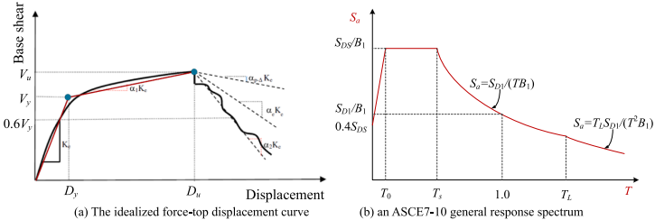

*Fig. 2. Two general concept curves for the nonlinear static procedure.*

> **Image commentary:** The figure consists of two sub-diagrams. Diagram (a) displays an idealized force-top displacement curve, with "Base shear" on the y-axis and "Displacement" on the x-axis, showing critical points \(D_y\), \(D_u\), \(V_y\), and \(V_u\), and demonstrating a nonlinear increase followed by a plateau. Diagram (b) shows an ASCE7-10 general response spectrum with "Sa" on the y-axis and "T" on the x-axis, highlighting \((SD_S/B_1)\) and \((0.4SD_S)\) levels, and indicating different spectral regions for periods \(T_0\), \(T_s\), and \(T_L\). Both diagrams illustrate key concepts in structural engineering analysis related to load and response behavior.

Fig. 2. Two general concept curves for the nonlinear static procedure.

# L. Xing et al.

The red star on the pushover curve is the performance point calculated using the NSP. The target displacement under the corresponding earthquake action can be expressed as [41,42]

$$
δ_t = C 0 C 1 C 2 Sa_T 2 e 4 π 2 g (1)
$$

where, C 0 = 1.1785, a modification factor to relate spectral displacement of an equivalent single-degree-of-freedom system to the roof displacement of the building multiple-degree-of-freedom system calculated using one of the following procedures; C 1 = 1 + μ strength 1 aT 2 e , a modification factor to relate expected maximum inelastic displacements to displacements calculated for linear elastic response, a = 60 is the site class factor, μ strength = Sa Vy / W Cm , a ratio of elastic strength demand to yield strength coefficient calculated, where W = 3 . 48 kN

1 + 1 800 ( μ strength 1 Te ) 2 , a modification factor to represent the effect of pinched hysteresis shape, cyclic stiffness degradation, and strength

/ m 2 , Cm = 1; Te = T 1 ̅̅̅ ̅ Ki Ke √ , an effective fundamental period of the building in the direction under consideration (in seconds), T 1 is the elastic fundamental period, Ki and Ke are the elastic lateral stiffness and the effective lateral stiffness of the building, respectively; C 2 =

deterioration on the maximum displacement response; Sa is the response spectrum acceleration at the effective fundamental period and damping ratio of the building. Although ASCE 7-22 is the most recent version, ASCE 7-10 [42] was used in this study as it is still widely adopted in practice, particularly for retrofitting and existing buildings. This version remains the basis for design guidelines in many regions. An ASCE7-10 general response spectrum [42] is shown in Fig. 2(b), where SDS = 2 3 SMS , SD 1 = 2 3 SM 1, SMS = FaSs ( Fa = 2 . 4 , Ss = 1, Site Class D), SM 1 = FvS 1 ( Fv = 1 . 6 , S 1 = 0 . 4, Site Class D), T 0 = 0 . 2 SD 1 SDS , Ts = SD 1 SDS , B 1 = 4 5 . 6 ln ( 100 β e ) ( β e = 0 . 05 ) . The performance point ( δ t , V δ t ) under the specific earthquake action above is also listed in the bottom table of Fig. 1. As shown in the bottom table, the two capacity points and one performance point derived from OpenSees are more closely aligned with those from SAP2000 compared to ETABS. Generally, SAP2000 handles nonlinear analysis more effectively than ETABS. Focusing on the comparison between OpenSees and SAP2000, the maximum error across the three points (six elements) is 6.76% for Vu , which falls within an acceptable range for engineering applications.

Table 1

Ranges and statistics of input features.

| Num. | Features | Variables | Distribution | Min | Max | Mean | COV |
| --- | --- | --- | --- | --- | --- | --- | --- |
| 1 | Breadth of one span | B (m) | U | 3.6 | 10 | 6.8 | 0.272 |
| 2 | Depth of one span | D (m) | U | 2.7 | 8.1 | 5.4 | 0.289 |
| 3 | Story height | H (m) | U | 3 | 5.4 | 4.2 | 0.165 |
| 4 | Number of span1 | B num | U | 2 | 5 | 3.5 | 0.247 |
| 5 | Number of span2 | D num | U | 2 | 5 | 3.5 | 0.247 |
| 6 | Number of storey | H num | U | 1 | 7 | 4.0 | 0.433 |
| 7 | Width of column | colWidth (m) | U | 0.3 | 1.2 | 0.75 | 0.346 |
| 8 | Depth of beam | beamDepth (m) | U | 0.4 | 1.2 | 0.80 | 0.289 |
| 9 | Ratio of depth to width of beam | beamRat | U | 0.33 | 0.5 | 0.415 | 0.118 |
| 10 | Area of steel bar in a column | A sc (mm 2 ) | U | 60 | 800 | 430 | 0.497 |
| 11 | Area of steel bar in a beam | A sb (mm 2 ) | U | 60 | 800 | 430 | 0.497 |
| 12 | thickness of slab | t (m) | TN | 0.1 | 0.25 | 0.12 | 0.02 [43] |
| 13 | cover of column | cover 1 (m) | TN | 0.02 | 0.05 | 0.04 | 0.05 [6] |
| 14 | cover of beam | cover 2 (m) | TN | 0.02 | 0.05 | 0.04 | 0.05 [6] |
| 15 | Concrete elastic tangent | E c (1e10 Pa) | TN | 3 | 3.6 | 3.15 | 0.15 [43, |
|  |  |  |  |  |  |  | 44] |
| 16 | Concrete Poisson ratio | nu c | U | 0.18 | 0.22 | 0.20 | 0.058 |
| 17 | Concrete compressive strength | f c (1e6 Pa) | TN | 14 | 30 | 27 | 0.20 [6] |
| - | Concrete strain at compressive strength | ε c 0 | - | ε c 0 = 2 ∗ f c / E c | - | - |  |
| 18 | Ratio of f cu to f c | f cu Rat | U | 0.2 | 0.3 | 0.25 | 0.115 |
| 19 | Concrete ultimate strain | ε cu | LN | 0.0005 + ε c 0 | 0.005 + ε c 0 | 0.0033 | 0.20 [6] |
| - | Ratio between unloading slope at ε cu and initial slope | λ | - | 0.1 | 0.1 | - | - |
| - | Concrete tensile strength | f ct | - | f ct = 0 . 1 ∗ f c | - | - |  |
| - | Concrete tension softening stiffness | E cs | - | E cs = f ct / 0 . 002 | - | - |  |
| 20 | Steel elastic tangent | E s (1e10 Pa) | LN | 1.9 | 2.2 | 2 | 0.05 [6] |
| 21 | Steel Poisson ratio | nu s | U | 0.25 | 0.35 | 0.30 | 0.096 |
| 22 | Steel yield strength | f sy (1e6 Pa) | LN | 300 | 500 | 400 | 0.08 [6] |
| 23 | Strain-hardening ratio | η | U | 0.008 | 0.04 | 0.024 | 0.384 |
| - | Control the transition from elastic to plastic bran | R 0 , c R 1 , c R 2 | - | R 0 = 20, c R 1 = 0.9215, c R 2 = 0.15 | - | - |  |
| - | Isotropic hardening parameters | a 1 , a 2 , a 3 , a 4 | - | a 1 = 0.0, a 2 = 1.0, a 3 = 0.0, a 4 = 0.0 | - | - |  |

# 3. Stochastic finite element analysis

# 3.1. Input features

Considering the geometry and material characteristics of a typical RCF, we select 29 features as listed in Table 1. Among these, 23 are variables, with corresponding statistics derived from practical RCF information and various references, including distribution types, minimum, maximum, mean values, and the coefficient of variation (COV). In cases where literature on the uncertainty of external dimensions is lacking, we assume a uniform distribution to consistently account for all possible external configurations. Uncertainties in material properties and smaller detail sizes are derived from previous research, as indicated in Table 1. The boundaries for the minimum and maximum values are based on expert judgment from experienced engineers. Additionally, a correlation analysis among input features was conducted to account for dependencies. Features with strong correlations were appropriately transformed as list in the expressions of Table 1 or excluded to prevent impractical or non-compliant configurations, ensuring the reliability and feasibility of the model. The symbols LN, U, and TN in Table 1 denote lognormal, uniform, and truncated normal distributions, respectively. The remaining 6 features are calculated using specific formulas provided in Table 1, based on the relevant variables.

During the experimental design phase, we considered the possibility of unrealistically large or unfeasible combinations of input parameters. Unrealistic configurations were addressed as follows: If the configuration resulted in a structure that was excessively soft, the pushover analysis either failed to converge or terminated in the initial steps due to numerical instability. These samples were excluded from the dataset. Conversely, if the configuration made the structure overly stiff, the pushover analysis was able to proceed until the maximum inter-story drift reached the prescribed limit of 2.4%. These results were retained in the training dataset. In such cases, where softening data is not available, we conservatively assume the identified peak point is the capacity limit. This assumption provides a safe and conservative estimate of the peak capacity, ensuring that the design remains on the safe side.

# 3.2. Database construction

As shown in Fig. 3, the process of constructing the surrogate model database is iterated as follows:

- Feature Sampling : Based on the input feature statistics outlined in Table 1, 2,000 initial training data sets are generated using Latin hypercube sampling [23,36], as seen on the left yellow area of Fig. 3.
- Output Obtaining : For each data set x { i } , representing one example, a finite element model of the RCF is created in OpenSees. A pushover analysis is then conducted. Based on the pushover curve and the NSP [41], two capacity points (yielding and peak points) are computed as output y = [ Dy , Vy , Du , Vu ] from the shear force-top displacement curve or y = [ IDy , IVy , IDu , IVu ] from the shear force-maximum inter-story drift curve.

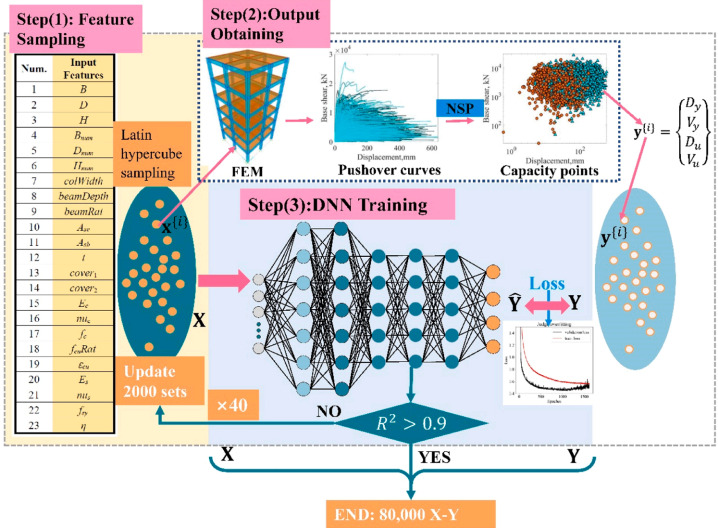

*Fig. 3. The flowchart of database construction for surrogate models.*

> **Image commentary:** The figure illustrates a flowchart for constructing a database for surrogate models in three steps: Feature Sampling, Output Obtaining, and DNN Training. In Step 1, feature sampling is performed using Latin hypercube sampling, generating input features. Step 2 involves using FEM to obtain outputs like pushover curves and capacity points. Step 3 shows training a Deep Neural Network (DNN), iterating until the model achieves an \( R^2 > 0.9 \), indicating high accuracy, and ends with an output dataset of 80,000 X-Y pairs.

Fig. 3. The flowchart of database construction for surrogate models.

| Loads | Resp. | #Features | #Layers | #Neurons | Batch size | Weight decay | Drop out | Batch norm | Train (R 2 ) | Test (R 2 ) | kriging (R 2 ) |
| --- | --- | --- | --- | --- | --- | --- | --- | --- | --- | --- | --- |
| Yielding point | D y | 23 | 6 | [128,128,64] | 128 | 0.4 | 0.2 | YES | 0.922 | 0.901 | 0.812 |
|  | V y | 23 | 6 | [128,128,64] | 128 | 0.4 | 0.2 | YES | 0.951 | 0.934 | 0.909 |
|  | ID y | 23 | 6 | [128,128,64] | 128 | 0.4 | 0.2 | YES | 0.919 | 0.906 | 0.854 |
|  | IV y | 23 | 6 | [128,128,64] | 128 | 0.1 | 0.2 | YES | 0.944 | 0.931 | 0.900 |
| Peak | D u | 23 | 6 | [256,128,64] | 128 | 2 | 0.3 | YES | 0.862 | 0.823 | 0.696 |
|  | V u | 23 | 6 | [128,128,64] | 256 | 0.4 | 0.15 | YES | 0.978 | 0.969 | 0.940 |
|  | ID u | 23 | 6 | [256,128,64] | 128 | 1.5 | 0.25 | YES | 0.862 | 0.789 | 0.674 |
|  | IV u | 23 | 6 | [256,128,128] | 128 | 0.4 | 0.2 | YES | 0.979 | 0.959 | 0.940 |

Note : the #Neurons has three elements. The first two elements present the neurons for the first two hidden layers, and the third element presents the neurons for the remaining hidden layers.

- DNNTraining : The input-output pairs x y are used to train a DNN. If the coefficient of determination (R²) is greater than 0.9, the procedure concludes. If not, an additional 2,000 sets of input data are sampled, pushover analyses are performed, and the resulting outputs y are combined with the previous sets. The DNN is retrained iteratively until R² exceeds 0.9.

While the traditional capacity curve focuses on the force-displacement ( V D ) relationship, we also consider inter-story drift ( ID ), which is a more widely accepted metric for measuring seismic performance in alignment with modern standards. Including ID ensures compatibility with future efforts to construct surrogate demand models, where inter-story drift is often the primary response parameter considered under seismic loads. For a six-story RCF, the base shear-inter story drift response is derived by calculating the inter story drift for each story at every step of the pushover analysis. The largest absolute inter story drift value among the six stories is then selected to represent the inter story drift at that step. This procedure ensures that the curve reflects the most critical deformation condition across all stories.

After 40 updates -each involving the generation of 2,000 new input-output pairs using Latin hypercube sampling [23,36] and nonlinear pushover analysis -the final database consists of 80,000 input-output pairs ( x y ). This iterative process ensures the surrogate models are trained on a diverse and representative dataset. Fig. 4 shows computational results from statistic finite element analyses showing the base shear versus deformation responses for various RCF configurations. These curves are used to extract yielding and peak capacity points, which serve as outputs for the development of surrogate capacity models. The random pushover analysis results, as shown in Fig. 4, primarily exhibit softening branches in the pushover curves. However, some curves continue to ascend, reaching the end limit where the maximum inter-story drift reaches 2.4%.

The load-deformation response shown in Fig. 4 was obtained using nonlinear beam-column elements with fiber-discretized sections, which effectively capture flexural inelasticity and the spread of plasticity. However, this approach has limitations in reproducing post-capping (softening) behavior, as it does not account for localized failure mechanisms such as shear failures. While the focus of this study is on flexural behavior, incorporating additional modeling techniques in the future work, such as shear hinges or advanced constitutive laws, would be necessary to accurately capture softening behavior in structures where it is critical.

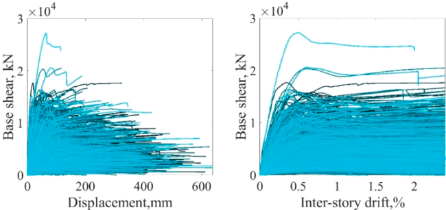

*Fig. 4. Pushover curves from the statistic pushover analysis.*

> **Image commentary:** The figure consists of two plots showing pushover curves from static pushover analysis. The left plot has "Displacement, mm" on the x-axis and "Base shear, kN" on the y-axis, while the right plot uses "Inter-story drift, %" as the x-axis and shares the same y-axis label. Both plots exhibit numerous overlapping curves indicating variability in base shear values with respect to both displacement and inter-story drift. The curves generally peak and then either plateau or decrease, suggesting changes in structural response under increasing load or deformation.

Table 2 The primary architecture of the regression neural networks.

Fig. 4. Pushover curves from the statistic pushover analysis.

# 4. Metamodeling based on DNNs

# 4.1. Training surrogate models using DNNs

DNNs are a powerful tool for multi-feature regression. Using the input-output database obtained previously, we constructed DNNs for the capacity points y = [ Dy , Vy , Du , Vu ] and y = [ IDy , IVy , IDu , IVu ] of the RCFs. The DNN architecture was carefully designed through a combination of extensive parametric studies and insights drawn from prior research on similar structural prediction tasks [17]. The initial configuration of the network, outlined in Table 2, consists of six layers, with 128 neurons in the first two layers and 64 neurons in the remaining layers. This configuration was selected based on iterative tuning and experimentation to balance model complexity and predictive accuracy. The choice of six layers was motivated by findings in the literature that suggest deeper architectures are better suited to capture complex nonlinear relationships inherent in structural data [47]. The specific distribution of neurons, 128 in the first two layers and 64 in the subsequent layers, was selected following initial experiments where larger layers were found to provide better representation of input features without causing excessive overfitting. Additionally, hyperparameters such as the learning rate, batch size, and regularization parameters (L2 regularization and dropout) were tuned based on model performance during training. For example, L2 regularization with a weight decay of 0.4 and a dropout rate of 0.2 were employed after observing tendencies of overfitting in preliminary models.

For the training process, we used an initial learning rate of 1 × 10 5 and a batch size of 128, both of which were selected based on empirical performance during early model training. The model was trained for a maximum of 3,000 epochs, with early stopping applied after 500 steps to prevent overfitting. The dataset was divided into a training set (80%) and a testing set (20%) to evaluate the model ' s performance and generalization ability. These design decisions were not based on a single prior benchmark but were the result of trial-and-error and performance validation, ensuring that the architecture could generalize well to unseen data.

We use Mean Squared Error (MSE) as the loss function to optimize the performance of the DNN model, as shown in Figs. 5-12(a). However, to address the dimensionality effect and make performance more interpretable across different responses (e.g., displacement, inter-story drift), we also report R² as a supplementary metric. R² provides a normalized measure of model accuracy, helping to clarify the model ' s ability to explain the variance in the predicted values. The R 2 value, after training and testing, is presented in Table 2. Additionally, the testing R 2 for surrogate models using optimal tuning kriging metamodeling [38] is listed in Table 2. Figs. 5-12 illustrate the loss for training and validation and provide comparisons between predicted values and true values for both the training and testing datasets, demonstrating the predictive effects.

# 4.2. Discussion for the size determination of the database

For surrogate models of outputs related to shear forces, i.e., Vy , Vu , IVy , and IVu , all testing R 2 values exceed 0.9, demonstrating significantly higher accuracy than those for deformation-related outputs, i.e., Dy , Du , IDy , and IDu . Among all the surrogate models, the IDu model exhibits the lowest accuracy due to the strong nonlinearity associated with peak inter-story drift.

It is well-known that increasing the size of the database, in addition to fine-tuning the DNN architecture, can enhance model accuracy. Table 3 illustrates the impact of database size on the accuracy of surrogate models for Du and IDu . Accuracy improves substantially as the database size increases up to 40,000 samples, after which the improvement stabilizes between 40,000 and 80,000 samples. This stabilization indicates that the model has already captured sufficient variability in the data to generalize the complex relationships inherent in these outputs, and additional data provide diminishing returns.

Conversely, for shear force-related outputs ( Vy , Vu , IVy , and IVu ), the relationships between input features and outputs are less complex and nonlinear, allowing high accuracy (R 2 > 0.9) to be achieved with a smaller database size of 20,000 samples. Beyond this size, the models do not benefit significantly from additional data, highlighting the varying data requirements based on the complexity of the output response.

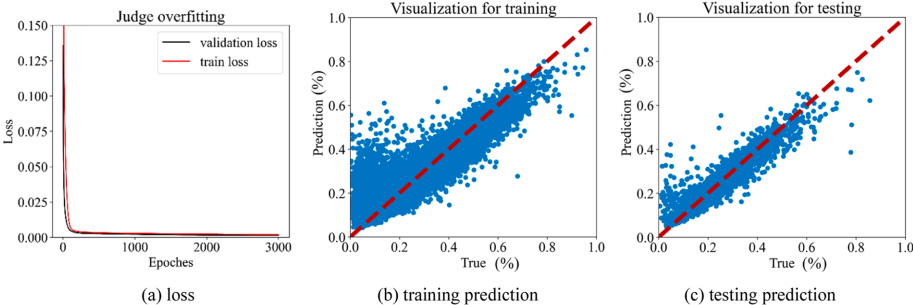

*Fig. 5. The training results of a DNN for the output, Dy .*

> **Image commentary:** The figure comprises three subplots, illustrating aspects of a Deep Neural Network's training process for output \( D_y \). Subplot (a) shows the loss over 3000 epochs with both training and validation losses decreasing and stabilizing around 0, indicating reduced overfitting. Subplots (b) and (c) depict prediction visualizations for training and testing, respectively, with data points clustering closely around the red dashed line (representing perfect prediction), implying good model performance. The x-axes in (b) and (c) represent the true values, while the y-axes show predicted values, both expressed in percentages.

Fig. 5. The training results of a DNN for the output, Dy .

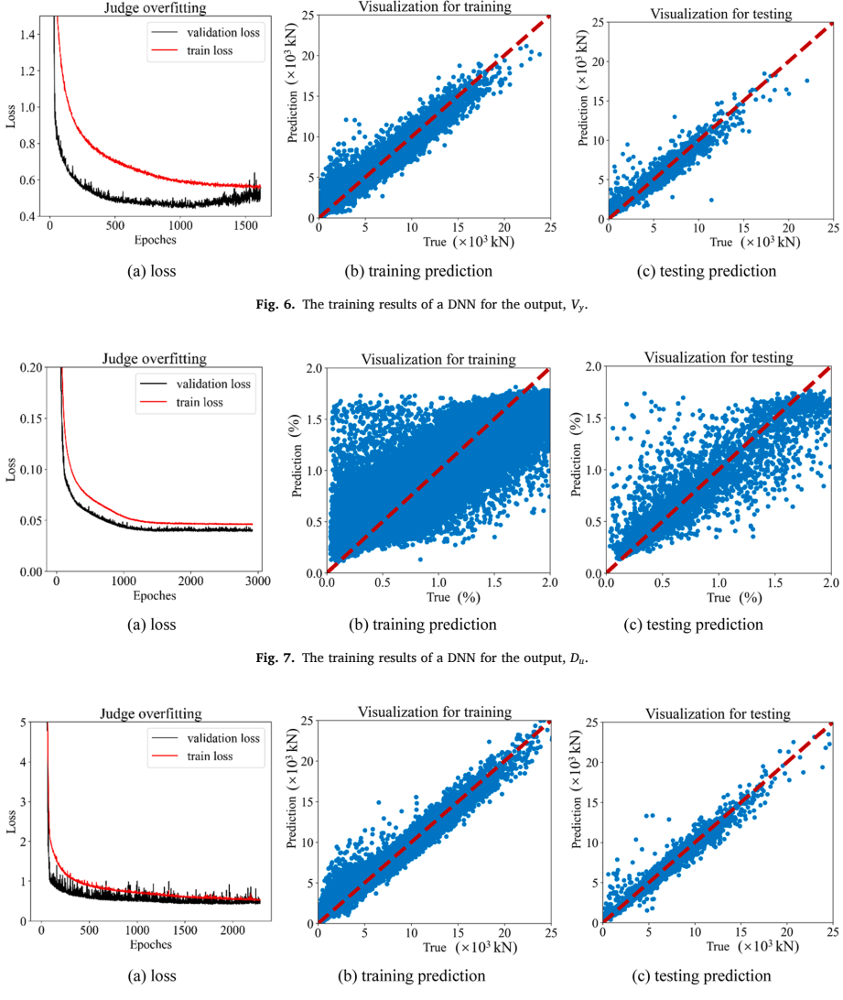

*Fig. 8. The training results of a DNN for the output, Vu .*

> **Image commentary:** The figure shows the training results of a DNN for the output \( V_u \) through three subplots. Subplot (a) depicts the loss over 3000 epochs, with separate lines for training and validation loss, both showing a decreasing trend and closely aligning, indicating low overfitting. Subplots (b) and (c) illustrate the relationship between true values and predictions for training and testing data, respectively, with predictions closely following the diagonal line, suggesting good predictive accuracy. The axes for (b) and (c) are labeled as "True (\( \times 10^3 \) kN)" and "Prediction (\( \times 10^3 \) kN)."

As shown in Table 2, the accuracy of all DNN surrogate models is higher than that of kriging surrogate models. However, the training cost for kriging models is significantly lower, as fewer hyperparameters need to be tuned. This trade-off between accuracy and computational efficiency underscores the suitability of DNNs for capturing complex relationships, particularly in deformation-related outputs, while kriging models may be preferred in scenarios where computational resources are limited.

Fig. 8. The training results of a DNN for the output, Vu .

Fig. 6. The training results of a DNN for the output, Vy .

Fig. 7. The training results of a DNN for the output, Du .

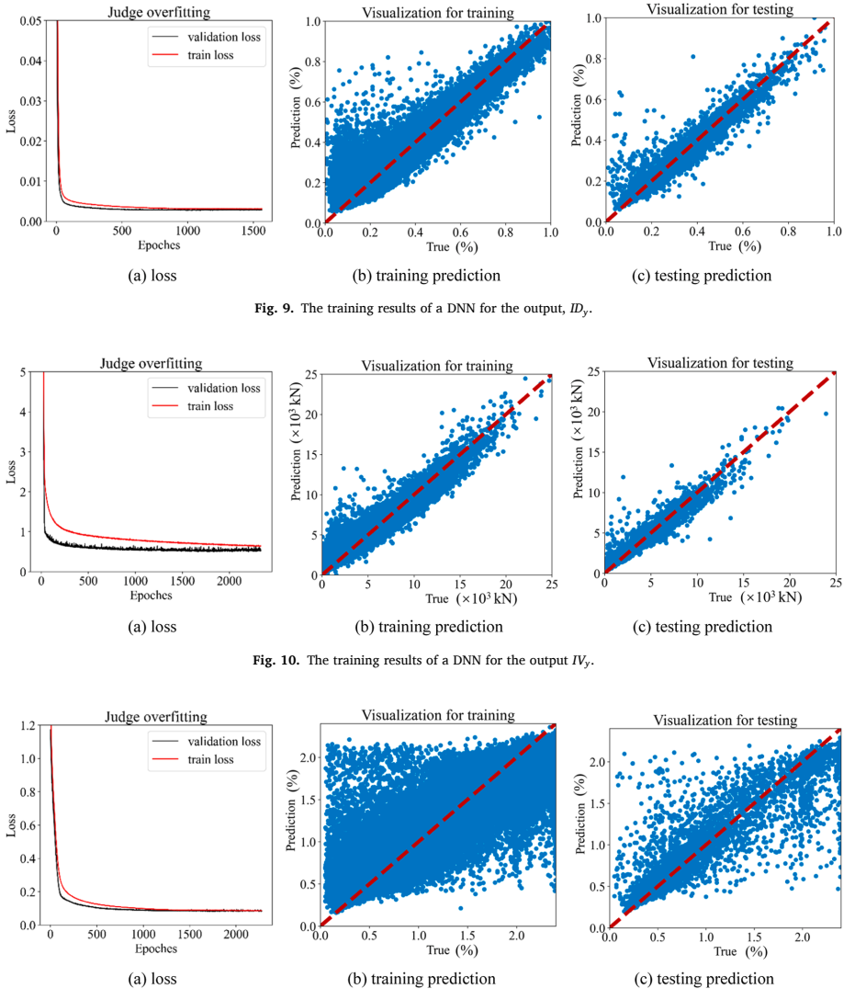

*Fig. 11. The training results of a DNN for the output, IDu .*

> **Image commentary:** Figure 11 presents the training results of a DNN for the output \(ID_u\). The loss plot (a) shows both training and validation losses decreasing over 2000 epochs, with no signs of overfitting. The scatter plots for training (b) and testing (c) predictions display predictions against true values, where data points are distributed around the diagonal line, indicating good predictive accuracy. Both plots (b and c) suggest a consistent model performance for the training and testing phases.

# 4.3. Retraining surrogate models with strong nonlinearity

To enhance the performance of the machine learning model, converting the original database into a more suitable form for model training, through techniques such as logarithmic transformation or normalization, is commonly applied during data preprocessing [6]. These techniques improve the scaling and distribution of the data, leading to faster convergence and more stable training, especially when the input data exhibits skewness or large variations in scale. The previous studies [18,48] demonstrated that logarithmic conversion for the seismic demand and capacity model of bridges can effectively reduce the nonlinearity, leading to improved model accuracy and performance. As mentioned above, we have normalized the input features, now we transform the output in the logarithm, i.e., ln ( Du ) and ln ( IDu ) , and retained the two DNNs with strong nonlinearity. The basic architecture of new regression neural networks is outlined in Table 4. Fig. 13 further shows the predictive effects via comparisons between the predicted values and the true values for the training and testing sets. The dashed red lines delimit the region within one standard deviation of the model. In a perfect model, data points should align along the 1:1 grey line. It is observed that the data points are evenly distributed on both sides of this line. The closer the data points are to the 1:1 line, the higher the R² value, indicating that two Log-output DNNs are unbiased and effectively capture the prevailing uncertainties. After the logarithmic transformation, it is concluded that ln ( Du ) -DNNandln ( IDu ) -DNNcan not be trained in the same level with the normal Du -DNN and IDu -DNN. [ ]

Fig. 11. The training results of a DNN for the output, IDu .

Fig. 9. The training results of a DNN for the output, IDy .

Fig. 10. The training results of a DNN for the output IVy .

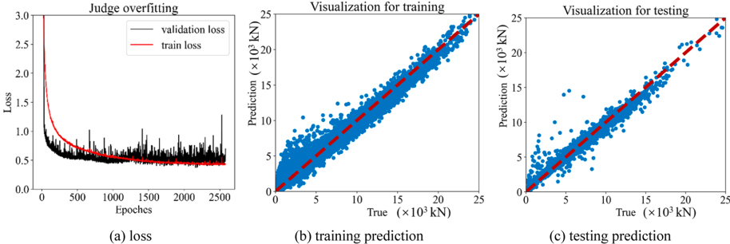

*Fig. 12. The training results of a DNN for the output, IVu .*

> **Image commentary:** The figure consists of three subplots: (a) shows a loss graph with epochs on the x-axis and loss on the y-axis, indicating that training loss decreases smoothly while validation loss fluctuates, suggesting some overfitting. (b) and (c) are scatter plots comparing true vs. predicted values (in \( \times 10^3 \text{kN} \)) for training and testing data, respectively; both exhibit a strong linear trend along the diagonal, marked by dashed red lines. The close clustering around the lines suggests that the DNN model is making accurate predictions.

| Size of dataset Output | 10,000 | 20,000 | 30,000 | 40,000 | 80,000 |
| --- | --- | --- | --- | --- | --- |
| D u ( R 2 ) | 0.770 | 0.786 | 0.801 | 0.820 | 0.823 |
| ID u ( R 2 ) | 0.703 | 0.745 | 0.766 | 0.786 | 0.789 |

The second endeavor dealing with strong nonlinearity is to use powerful algorithms. Given the output y = Dy , Vy , Du , Vu plus y = [ IDy , IVy , IDu , IVu ] as a 8-variable sequence, the popular Transformer is selected. A Transformer is a deep learning model architecture primarily used for tasks involving sequence data, such as natural language processing, time series forecasting, and more. It was introduced in the paper "Attention is All You Need" by Vaswani et al. [49] and is designed to process input data in parallel, which makes it more efficient than traditional sequence models like RNNs [50] or LSTMs [51]. The key component of the Transformer is self-attention, which allows the model to weigh the importance of different elements of the input sequence when making predictions, regardless of their position in the sequence. This attention mechanism enables the model to capture long-range dependencies and relationships in the data without the need for recurrence or convolution.

First, the 8-variable-output Transformer is trained. However, After optimal tuning, large accuracy differences are observed. The shear-force related output y = [ Vy , IVy , Vu , IVu ] has very high accuracy in the test set, i.e., larger than 0.95, while deformation related output y = [ Dy , IDy , Du , IDu ] have accuracies around 0.75 in the test set. As shown in Table 2, the DNNs targeting the shear-force related outputs has already been trained very successful. Given such factors, we then only consider deformation related output y = [ Dy , IDy , Du , IDu ] as the output sequence of a Transformer model.

The primary architecture of the 4-variable-output Transformer is outlined. AdamW is used as the optimization algorithm; all features are normalized; the initial learning rate is 1 × 10 4 ; the number of the epoch is 1,000; batch size is 64. For Transformer layers: the number of Transformer encoder-decoder layers is 6; the hidden size is 80; the number of attention heads is 8. For fully-connected layers: after Transformer layer, the number of fully-connected layers is 2; the activation function is ReLU [45]; the number of neurons is 64. To mitigate overfitting, L2 regularization [46] with a weight decay value of 0.4 and a dropout with a rate of 0.2 are selected, the early stopping is 50 steps. From the above Transformer architecture, the Transformer is constructed in the simplest form and no any mask is used due to the same length output, here equal to 4.

| Log-DNN |  |  |  | Batch | Weight decay |  |  |  | Transformer | Transformer | DNN |
| --- | --- | --- | --- | --- | --- | --- | --- | --- | --- | --- | --- |
| Resp. | #Features | #Layers | #Neurons | size |  | Drop out | Train (R 2 ) | Test (R 2 ) | Train (R 2 ) | Test (R 2 ) | Test (R 2 ) |
| D u | 23 | 10 | [256,128,64] | 128 | 1.0 | 0.20 | 0.875 | 0.796 | 0.857 | 0.800 | 0.823 |
| ID u | 23 | 10 | [128,128,64] | 128 | 0.4 | 0.2 | 0.842 | 0.785 | 0.858 | 0.787 | 0.789 |

Fig. 12. The training results of a DNN for the output, IVu .

Table 3 Accuracy comparisons of DNNs for different sizes of the input-output database.

Table 4 The primary architecture of new regression neural networks after logarithmic transformation.

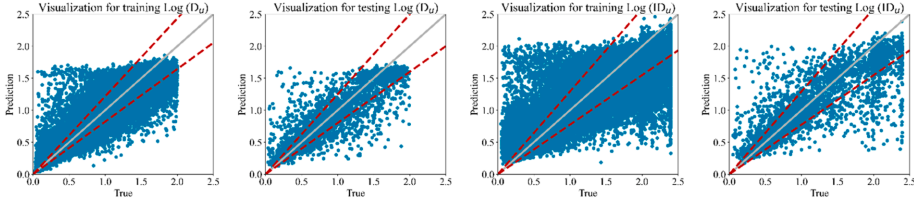

*Fig. 13. The training results of two Log-DNNs for the output, ln ( Du ) and ln ( IDu ) .*

> **Image commentary:** The figure consists of four scatter plots visualizing the results of training and testing two Log-DNNs for the outputs \( \ln(D_u) \) and \( \ln(ID_u) \). Each plot has "True" values on the x-axis and "Prediction" values on the y-axis, with a solid line representing perfect agreement (y=x) and dashed lines indicating some deviation. The plots for training data show a dense clustering of points near the y=x line, suggesting good model performance, while the testing plots display more scatter, indicating potential overfitting or variability in predictions. The consistent structure of results across training and testing for both outputs implies systematic model behavior.

![Fig. 14. The training results of a Transformer for the 4-variable output, [ Dy , IDy , Du , IDu ] .](assets-for-markdown/page_012_figure_002.png)

*Fig. 14. The training results of a Transformer for the 4-variable output, [ Dy , IDy , Du , IDu ] .*

> **Image commentary:** The figure comprises four scatter plots with "True" values on the x-axis and "Prediction" values on the y-axis, each ranging from 0 to 2.5. Two plots represent training results, and the other two represent testing results, for variables Dy (indicated by triangles) and Du (indicated by circles). A central solid line represents perfect predictions, with two dashed lines indicating a margin of error. Data points for Dy tend to cluster more towards the lower prediction range compared to Du.

To enhance model performance, we apply a learning rate scheduler that reduces the learning rate when a monitored metric has stopped improving. Typically, models benefit from reducing the learning rate by a factor of 2-10 once training plateaus. This scheduler monitors a specified metric, and if no improvement is observed after a defined ' patience ' number of epochs, the learning rate is automatically decreased to help the model converge more effectively. In this study, the factor by which the learning rate will be reduced is equal to 0.2 with the patience equal to 10. The final accuracies for Du - and IDu -Transformer are also listed in Table 4. Fig. 14 demonstrates the predictive effects via comparisons between the predicted values and the true values for the training and testing sets.

From Table 4, it can be seen that for outputs with strong nonlinearity, i.e., Du and IDu , neither the Log-DNNs (after logarithmic transformation) nor the more advanced Transformer models improve predictive performance compared to standard DNNs. The current accuracy achieved by the normal DNNs represents the best possible result. Therefore, the DNNs described in Section 4.1 are selected to perform the subsequent sensitivity analysis and fragility estimates.

# 4.4. Sensitivity analysis

Sensitivity analysis in structural engineering is a process used to assess how variations or uncertainties in certain input features affect the performance and behavior of a structural system. Sensitivity analysis involves varying one or more input features while keeping others constant to evaluate their influence on the model outputs, often quantifying this influence to assess the model ' s sensitivity to different inputs [17]. For the global model agnostic, the partial dependence plot (PDP) is selected. PDP shows the marginal effect one or two features have on the predicted outcome of a machine learning model [12]. A PDP can show whether the relationship between the target and a feature is linear, monotonic, or more complex. The individual conditional expectation (ICE) plots [13] display one line per instance that shows how the prediction of an instance changes when a feature changes. In this paper, to save space, we only present the PDP and ICE of the output response Vy in Fig. 15.

For local model agnostic, we select the SHapley Additive exPlanations (SHAP) [14] method to illustrate the sensitivity analysis in the form of the heatmap plot. SHAP is a method used in machine learning and interpretability to explain the output of a machine learning model by attributing the contribution of each feature to the model predictions. SHAP values provide a way to understand how individual features influence the model output. The Shapley value of a feature value is its contribution to the output, weighted and summed over all possible feature value combinations. The SHAP for 8 DNN surrogate models is demonstrated in Fig. 16. Based on the SHAP values, Table 5 lists the first four important features of 8 surrogate models.

From Fig. 15, the PDPs of the DNN demonstrate that the relationship between output Vy and each of the 23 features is both clear and well-defined. The plots exhibit smooth and straightforward monotonic trends, suggesting stable, predictable relationships between these features and the structural response. This consistency in behavior is not only evident for Vy -DNN, but also extends to other 7 capacity components, although these are not explicitly shown in this study.

Moreover, Fig. 16 and Table 5 reveal that certain features, particularly those related to the dimensions of the columns, beams, and reinforcement bars, exert a more significant influence on the overall capacity of the RCFs. Features like column width colWidth , beam depth beamDepth , and the areas of steel reinforcement in columns and beams ( Asc and Asb , respectively) stand out for their larger sensitivity in shaping the structural performance. A key insight from Fig. 16 is that colWidth and the beamDepth have opposite effects on deformation-related capacities (e.g., Dy , Du , IDy , IDu ) compared to shear-force-related capacities (e.g., Vy , Vu , IVy , IVu ). Specifically, increasing the column width and beam depth tends to reduce the deformation capacity, yet it enhances the shear-force capacity. This contrast highlights the trade-offs inherent in structural design choices, where boosting one aspect of capacity may compromise another.

Fig. 13. The training results of two Log-DNNs for the output, ln ( Du ) and ln ( IDu ) .

Fig. 14. The training results of a Transformer for the 4-variable output, [ Dy , IDy , Du , IDu ] .

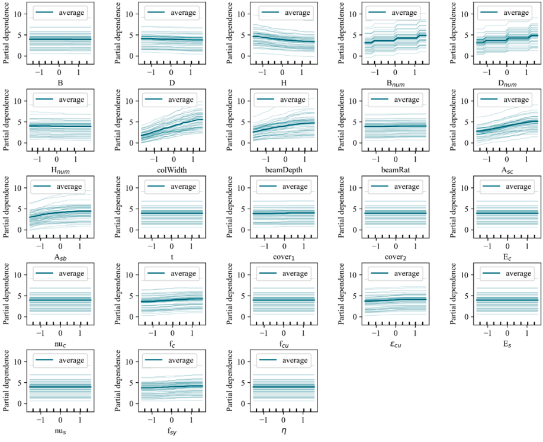

*Fig. 15. The PDP and the ICE of output response, Vy .*

> **Image commentary:** The figure consists of multiple panels, each displaying a partial dependence plot (PDP) and individual conditional expectation (ICE) curves for different variables' impact on the output response, Vy. The x-axes represent standardized variable values ranging from -1 to 1, while the y-axes show partial dependence on Vy. Each panel includes multiple ICE curves (in light blue) and an average PDP line (in dark blue), indicating individual and average effects of that specific variable on the output. Generally, trends are observed where some variables show varying degrees of impact on Vy, as indicated by the spread and slope of the curves.

On the other hand, the rebar-related features ( Asc for column steel area and Asb for beam steel area) exhibit a uniformly positive influence on both deformation and shear capacities in our surrogate models. However, this finding reflects the global capacity trends captured by the models and does not fully account for localized effects or trade-offs between strength and ductility. For instance, while increasing Asc generally enhances column strength, it may reduce ductility due to reduced energy dissipation and increased stiffness. Similarly, beam ductility is influenced by the balance between tension and compression reinforcement, which is not explicitly modeled in this study. The use of absolute reinforcement areas ( Asc and Asb ) as input features simplifies the relationships and limits the model ' s ability to capture these nuanced effects. Future studies could incorporate detailed reinforcement configurations to better account for these trade-offs.

The sensitivity analysis indicates that colWidth and beamDepth have a significant impact on the structural response. This result may be influenced by the choice of uniform distributions with extended maximum values for these variables, which allow the surrogate models to explore a broader design space. While these ranges contribute to the sensitivity conclusions, more refined distributions based on realistic design practices could enhance the applicability of the findings. Regarding reinforcement, the use of absolute steel areas ( Asc and Asb ) was dictated by the requirements of the OpenSees modeling framework. However, the steel ratio is a more mechanicsbased parameter commonly used in structural design. Although Asc and Asb indirectly reflect the steel ratio when paired with crosssectional dimensions, future studies could incorporate steel ratio as an input feature to better align with design practices and pro- vide deeper insights into the mechanics-based behavior of RCFs.

Fig. 15. The PDP and the ICE of output response, Vy .

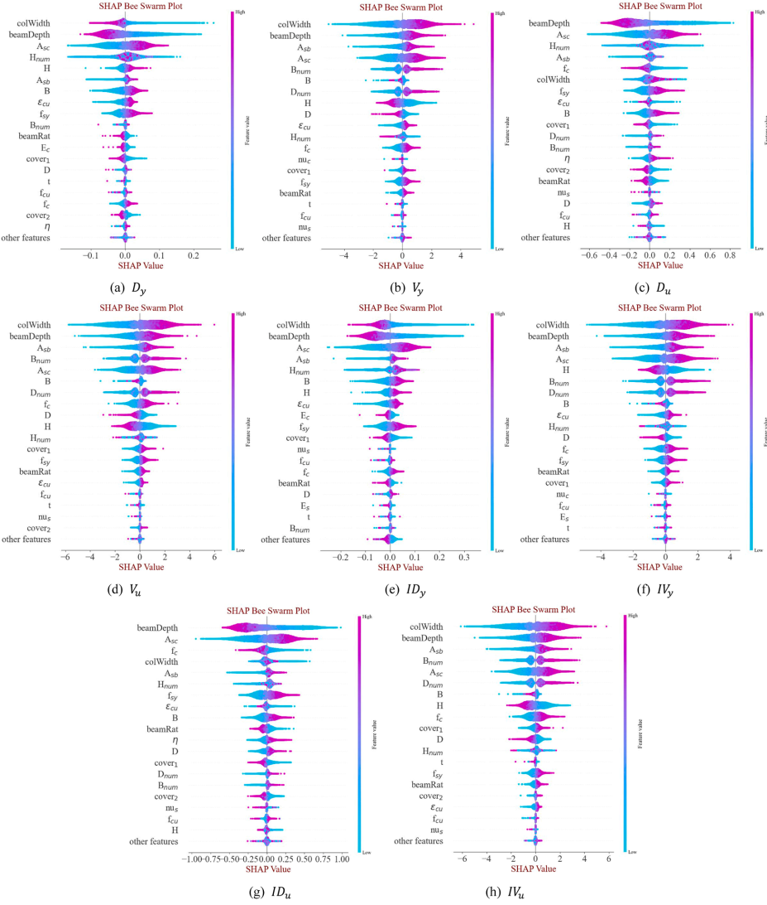

*Fig. 16. The SHAP of 8 DNN surrogate models.*

> **Image commentary:** The figure presents SHAP bee swarm plots for eight DNN surrogate models, labeled (a) to (h). Each plot displays the impact of various features on the model's output, with the y-axis representing feature names and the x-axis showing the SHAP values, indicating the contribution of each feature. The plots use a color gradient from blue to pink to depict feature value magnitudes, with blue indicating lower values and pink indicating higher values. Visible trends suggest that certain features consistently have larger SHAP values, indicating a stronger influence on model predictions across multiple plots.

Ultimately, as indicated by their heightened sensitivity, features such as column dimensions, beam dimensions, and reinforcement areas should be given particular attention in the design and optimization of RCFs to ensure a balance between deformation and shear capacities, tailored to the specific demands of the structure.

Fig. 16. The SHAP of 8 DNN surrogate models.

| Sort | D y | V y | D u | V u | ID y | IV y | ID u | IV u |
| --- | --- | --- | --- | --- | --- | --- | --- | --- |
| 1 2 3 4 | colWidth beamDepth A sc H num | colWidth beamDepth A sb A sc | beamDepth A sc H num A sb | colWidth beamDepth A sb B num | colWidth beamDepth A sc A sb | colWidth beamDepth A sb A sc | beamDepth A sc f C colWidth | colWidth beamDepth A sb B num |

# 5. Fragility estimates using DNNs

# 5.1. Fragility formulation

After constructing DNN surrogate models, we then use them to estimate the RCF fragility. Following the conventional notation in structural reliability theory [18], we define a limit state function gk ( x , Θ ) such that the event { gk ( x , Θ ) ≤ 0 } describes the failure in the k th limit state of interest. x is the augmented model parameters including the material and geometrical features θ s and a vector of demand variables such as base shear forces or deformations s , i.e., x = ( θ s , s ). Θ is a vector of hyperparameters of DNN surrogate models. The limit state functions can be formulated as

$$
gk ( θ_s, s, Θ) = Ck ( θ_s, s, Θ) Dk ( θ_s, s) (2)
$$

where Ck denotes the capacity for the k th failure mode which is computed using the well-trained DNN, Dk is the given demand for the k th failure mode.

The frame fragility can be written as

$$
F ( r ', s, Θ) = P [ ∪ k { gk ( θ_s, s, Θ_k)≤ 0 | r ', s, Θ_k } ] (3)
$$

where P [ A | B ] denotes the conditional probability of the event A for the given event B; r ʹ from θ s denotes those variables with inherent randomness in the geometry and material properties. Following Gardoni et al. [18] The predictive fragility estimate, ̃ F ( s ) , is the expected value of F ( r ' , s , Θ ) over the distribution of r ʹ and Θ , i.e.,

$$
̃ F ( s) = ∫ F ( r ', s, Θ) f ( r ') f ( Θ) d_r ' d Θ (4)
$$

where the statistics of r ʹ are listed in Table 1; Considering the important effect on the testing accuracy, for the neural network hyperparameters Θ , we specifically consider weight decay and dropout rate, as these parameters significantly influence the generalization and robustness of the DNN models. Their means are equal to those in Table 2 and COVs are 20%. The fragility function ̃ F ( s ) incorporates uncertainties from material and geometrical features ( r ʹ ) and the hyperparameters of the DNN surrogate models ( Θ ). These sources of uncertainty capture variability in structural properties and model predictions. Regarding the role of model error, it is implicitly included within the hyperparameters Θ . The uncertainty associated with Θ reflects the surrogate model ' s predictive variability, encompassing errors from the model itself. While model error is not explicitly represented as a distinct term, its effects are embedded in the fragility function, ensuring that the predictions account for both structural and model-related uncertainties.

Monte Carlo Simulation (MCS) is known as a simple random sampling method or statistical trial method that makes realizations based on randomly generated sampling sets for uncertain variables [52]. It is a powerful mathematical tool for determining the approximate probability of a specific event that is the outcome of a series of stochastic processes. The computation procedure of MCS is quite simple: 1) select a distribution type for the random variable; 2) generate a sampling set from the distribution; 3) conduct simulations using the generated sampling set.

First, the sampling set of the corresponding random variables is generated according to the statistics in Table 1, except the first 6 external dimensions are fixed, = 7m , D = 5m , H = 4m, Bnum = 2, Dnum = 2, Hnum = 4. Next, DNN surrogate models are fed with the generated sampling set for rapid output responses. Then, we can easily obtain the probabilistic characteristics of RCF responses. If the limit-state function g ( ⋅ ) is violated, the RCF or RCF ' s element has ' failed. ' The trial is repeated many times to guarantee convergence of the statistical results. In each trial, sample values can be digitally generated and analyzed. If N trials are conducted, the probability of failure is given approximately by

$$
Pf = Nf_N (5)
$$

where Nf is the number of trials for which g ( ⋅ ) is violated out of the N experiments conducted. The failure probability is also written as

$$
Pf = P [ g ( X) ≤ 0 ] = ∫ ⋯ ∫ I ( X) f_X ( X) d_X (6)
$$

where X = ( x , Θ ) , I ( X ) is an indicator function, which equals 1 if g ( ⋅ ) ≤ 0 is ' true ' and 0 if g ( ⋅ ) ≤ 0 is ' false ' ; f ( X ) is the joint probability density function. Using the MCS, the estimate of Pf is obtained

Table 5 The first four important features of 8 surrogate models.

$$
̂ Pf = 1 N ∑_{i=1}^{N} I_x i, Θ_i) (7)
$$

# 5.2. Fragility curve

Based on the sensitivity analysis in Section 4.3, the important input features: colWidth , beamDepth , and Asc , are assigned four different means for each demand. When varying any of colWidth , beamDepth , or Asc , there are always four example RCFs, consistently designated as SCH1 to SCH4. The four means selected for both colWidth and beamDepth are 0.4m, 0.6m, 0.8m, and 1.0m, while the four means selected for Asc are 200mm², 400mm², 600mm², and 800mm². When one of colWidth , beamDepth , or Asc is varied, the other 16 unfixed features are kept at their respective uncertainties as listed in Table 1. These ranges were chosen to capture a broad variety of structural configurations and ensure the generalizability of the surrogate models. However, we acknowledge that certain combinations, such as a 1.0m x 1.0m column in a 4-story building with a B × D = 7 m × 5 m bay configuration, may not reflect typical design scenarios. Such configurations are included to test the robustness of the models and do not necessarily represent practical designs. Additionally, the frame designs used in this study do not constrain the beam-to-column strength ratio to comply with capacity design principles. This approach allows the study to encompass both existing buildings, which may not adhere to such principles, and newly designed structures. For practical applications involving new buildings, incorporating capacity design principles, such as ensuring a suitable beam-to-column strength ratio, is critical to achieving ductile behavior and preventing column failure. These considerations could be integrated into future studies for improved alignment with practical design standards.

Figs. 17-24 show the predictive fragility curves of example RCFs for different DNN surrogate models. Fig. 25 shows the contour plot of the predictive fragility surface ̃ F ( d , v ) with regard to two arguments, the deformation and shear force ( Dy Vy , Du Vu , IDy IVy , IDu IVu ). Figs. 17-24 illustrate similar sensitivity characteristics of fragility as seen in the sensitivity of output responses in Fig. 16, as specified in Table 6.

The fragility estimate for deformation failure, particularly for Du and IDu , is more heavily influenced by structural nonlinearity compared to other output response components. Larger cross-sections of columns and beams generally increase the overall stiffness and strength of RCFs, which decreases the probability of shear failure while increasing the likelihood of deformation-related fragility due to delayed failure modes. When the target becomes fragility, the sensitivity of RCFs to three critical features -colWidth , beamDepth , and Asc -changes. Specifically, fragility is less sensitive to colWidth compared to beamDepth and Asc , despite colWidth being the most sensitive feature for the overall RCF response components listed in Table 4. This reduced sensitivity can be attributed to the role of colWidth in enhancing load redistribution within the frame, which mitigates its direct influence on deformation-related fragility.

As indicated by the sensitivity analysis and Table 6, the Asc feature shows a positive correlation with fragility, as increasing Asc enhances both deformation and shear-force capacities. However, colWidth and beamDepth exhibit negative or chaotic correlations with fragility targeting deformation capacities ( Du and IDu ), likely due to their complex interactions with stiffness, strength, and nonlinear structural behavior. These intricate relationships contribute to the variability observed in deformation-related fragility and help explain the lower accuracy of surrogate models predicting deformation capacities, as shown in Table 2.

# 6. Discussion and limitation for the application of surrogate models

This study focuses on developing surrogate capacity models for RCFs to efficiently predict structural yielding and peak capacity. While the current research is limited to this specific building type, it lays the groundwork for future applications in community-level reliability analysis. By combining various surrogate models for different structures -such as shear walls (SWs), frame shear walls (FSWs), and frame-core tubes (FCTs) -large-scale simulations can assess a community ' s overall resilience to multi-hazard scenarios.

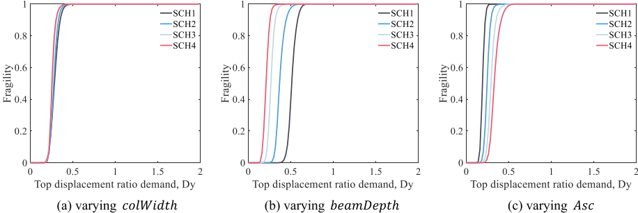

*Fig. 17. Fragility estimate for RCFs targeting an output, Dy .*

> **Image commentary:** The figure comprises three graphs showing fragility estimates for RCFs targeting an output represented by Dy. The x-axis in each graph is labeled "Top displacement ratio demand, Dy," ranging from 0 to 2, while the y-axis is labeled "Fragility," ranging from 0 to 1. Each subplot examines different variables: (a) colWidth, (b) beamDepth, and (c) Asc, with curves representing different schemes (SCH1 to SCH4). All graphs show a rapid increase in fragility, with distinct separations and overlaps among the schemes.

Fig. 17. Fragility estimate for RCFs targeting an output, Dy .

L. Xing et al.

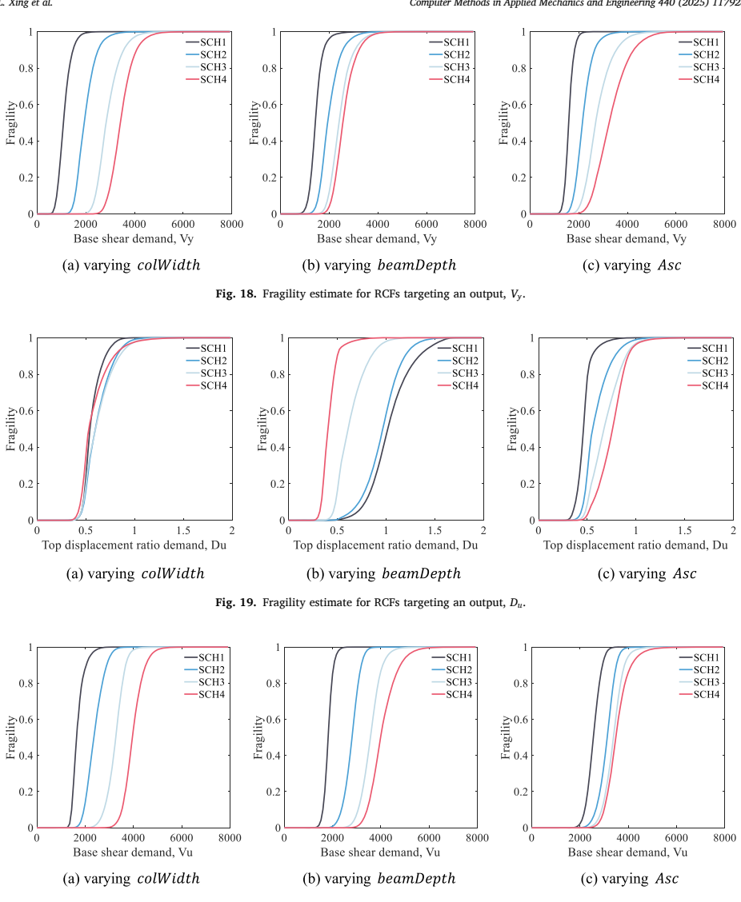

*Fig. 20. Fragility estimate for RCFs targeting an output, Vu .*

> **Image commentary:** The figure illustrates the fragility estimates for reinforced concrete frames (RCFs) targeting an output, Vu, through three graphs (a), (b), and (c), each reflecting different parameters: colWidth, beamDepth, and Asc, respectively. The x-axis represents base shear demand, Vu, ranging from 0 to 8000, while the y-axis represents fragility, ranging from 0 to 1. Each graph includes four curves, labeled SCH1 to SCH4, indicating different scenarios or configurations, showing that fragility increases with base shear demand. Notably, SCH1 consistently shows higher fragility across the scenarios compared to the others.

The research envisions a virtual community composed of these common building types, where individual building fragility is determined by their respective surrogate models. For the community ' s overall resilience, two types of models are used: capacity models, as developed here, and demand models, which are more complex and currently in progress. Demand models account for hazard sequences like earthquakes and tsunamis. Future work will focus on rapid disaster response and evacuation planning, offering decisionmakers real-time hazard assessments and disaster warnings. We use a virtual RCF community as an example to illustrate the entire process of assessing community-level reliability, as shown in Fig. 26. This approach aims to improve disaster preparedness and response strategies by providing faster, more cost-effective alternatives to traditional reliability analysis methods.

Fig. 20. Fragility estimate for RCFs targeting an output, Vu .

Fig. 18. Fragility estimate for RCFs targeting an output, Vy .

Fig. 19. Fragility estimate for RCFs targeting an output, Du .

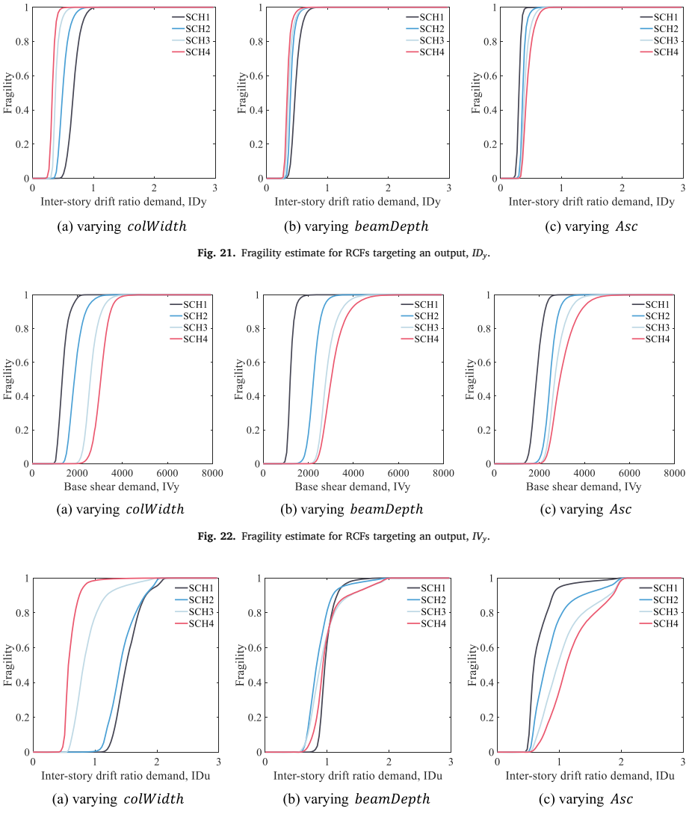

*Fig. 23. Fragility estimate for RCFs targeting an output, IDu .*

> **Image commentary:** Figure 23 presents fragility estimates for RCFs targeting an output labeled IDu, with three subfigures. Each subfigure shows fragility (y-axis) against inter-story drift ratio demand, IDu (x-axis), under different conditions: varying column width, beam depth, and Asc. The curves represent different scenarios (SCH1 to SCH4), displaying varied slopes and positions, indicating differing levels of fragility across the scenarios. Notably, SCH4 often shows a steeper rise compared to the others, suggesting higher fragility.

Input samples in this study were generated using Latin hypercube sampling, bounded by reasonable statistical assumptions for each input feature based on engineering judgment and literature. Although some input combinations may represent configurations that are rare in practice, they remain physically plausible and adhere to fundamental mechanical principles. These configurations were included in the dataset to capture a comprehensive spectrum of structural behaviors, akin to how discrete points are used to approximate a continuous curve.

Fig. 23. Fragility estimate for RCFs targeting an output, IDu .

Fig. 21. Fragility estimate for RCFs targeting an output, IDy .

Fig. 22. Fragility estimate for RCFs targeting an output, IVy .

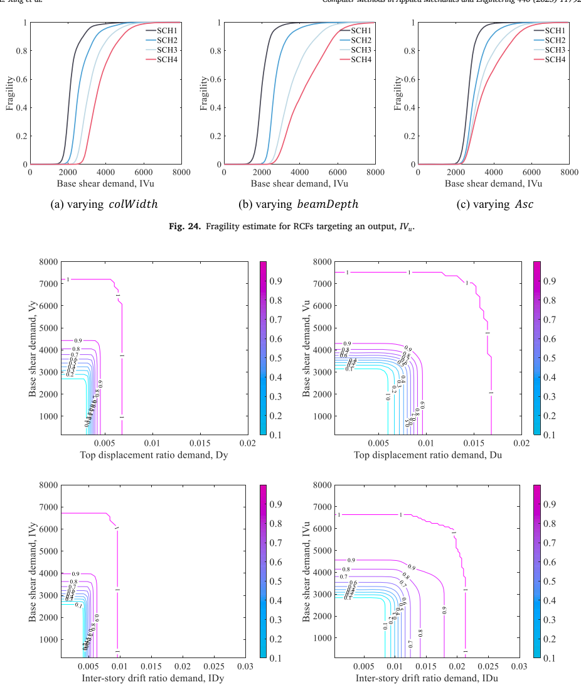

*Fig. 25. Contour map of predictive deformation-shear fragility surface of RCFs.*

> **Image commentary:** The figure displays four contour maps depicting the predictive deformation-shear fragility surface of reinforced concrete frames (RCFs). Each subplot shows contours of fragility across different axes, with the horizontal axes representing various demands such as top displacement ratio (Dy and Du) and inter-story drift ratio (IDy and IDu), while the vertical axes represent base shear demand (Vu and Vy). The contour lines range from 0.1 to 0.9, indicating varying levels of fragility. The color gradient from cyan to magenta signifies increasing fragility values.

| Sort | D y or ID y | V y or IV y | D u or ID u | V u or IV u |
| --- | --- | --- | --- | --- |
| colWidth beamDepth Asc | negative negative positive | positive positive positive | negative chaos positive | positive positive positive |

Fig. 25. Contour map of predictive deformation-shear fragility surface of RCFs.

Fig. 24. Fragility estimate for RCFs targeting an output, IVu .

Table 6 Fragility-related characteristics to critical input features.

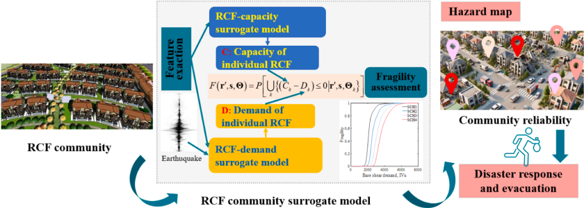

*Fig. 26. Assessment of RCF community-level structural systems ' reliability.*

> **Image commentary:** The figure illustrates the assessment process of RCF community-level structural systems' reliability, featuring a flow diagram. It includes an RCF community and integrates surrogate models for both capacity and demand, influenced by earthquake data. The fragility assessment section calculates the probability function \( F(r,s,\Theta) \), illustrating the potential for capacity-demand shortfalls, and is linked to a graph showing base shear demands. This information informs hazard maps and community reliability, aiding in disaster response and evacuation planning.

The surrogate models developed in this study are designed for predicting capacity responses rather than for directly informing RCF design. Future optimization of RCFs will use these surrogate models in conjunction with optimization algorithms such as multiobjective genetic algorithms. Therefore, while the inclusion of rare or atypical configurations broadens the dataset ' s applicability, it does not adversely impact the surrogate models ' predictive accuracy, which is the primary focus of this study.

We acknowledge that, in this study, we have fully focused on data-driven approaches and did not explore hybrid models that combine the strengths of both physics-informed and data-driven methodologies. While data-driven models have shown promise in our context, we recognize that physics-informed neural networks (PINNs) have demonstrated significant potential in complex, nonlinear structural problems. In future work, we plan to investigate the integration of PINNs to improve both the accuracy and interpretability of the models, leveraging the strengths of both approaches. This hybrid approach may offer additional advantages in modeling structural behavior under seismic loads.

# 7. Conclusions

This paper proposed surrogate capacity models of the reinforced concrete frames (RCFs) using deep neural networks (DNNs) and more advanced Transformer based on random finite element analysis. In this study, we establish the input feature statistics drawing on some references and engineering practices. We validate our finite element modeling method to ensure data reliability. Employing Latin hypercube sampling, we generate samples based on predetermined input feature statistics. Using OpenSees, we build 3D finite element models for each sample and conduct pushover analysis to obtain capacity curves (output information). We incrementally expand the dataset until predictive accuracy meets specified criteria, completing the input-output database.

Using this database, we first determine the optimal hyperparameters for the DNN architecture, striking a balance between accuracy and model complexity to finalize the surrogate capacity models. However, due to the strong nonlinearity in deformation-related surrogate models, lower accuracies are observed. These are further improved by employing logarithmic transformation and the more powerful Transformer model. Despite these enhancements, the accuracy achieved by the standard DNNs remains the best possible result. We assess the global and local sensitivity of these models using Partial Dependence Plot (PDP) and SHapley Additive exPlanations (SHAP). The analysis reveals that the size of columns, beams, and the rebars within them have the most significant impact on the capacity of the RCFs, as indicated by their larger sensitivity. Additionally, increasing the size of columns and beams (i.e., colWidth and beamDepth ) leads to a decrease in deformation capacity and an increase in shear-force capacity. Conversely, for rebar areas Asc for columns and Asb for beams, both deformation capacity and shear-force capacity consistently increase with increases in these features.

Considering the uncertainty of input features and DNN hyperparameters, we use the DNN surrogate models to formulate fragility estimates for example RCFs. Fragility curves objectively quantify the reliability of RCFs. The fragility assessment reveals several key insights: 1). Fragility estimates for deformation failure, especially peak deformation Du and IDu , are significantly influenced by structural nonlinearity compared to all other output responses. 2). Larger cross-sections of columns and beams increase the probability of an RCF experiencing deformation failure while decreasing the probability of shear failure. 3). Sensitivity to three critical features ( colWidth , beamDepth , and Asc ) differs between the response models and the fragility models.

# CRediT authorship contribution statement

Lili Xing: Writing -review & editing, Writing -original draft, Visualization, Validation, Resources, Methodology, Investigation, Funding acquisition, Data curation, Conceptualization. Paolo Gardoni: Writing -review & editing, Supervision, Methodology, Conceptualization. Ge Song: Writing -original draft, Software, Investigation. Ying Zhou: Writing -review & editing, Supervision, Conceptualization.

Fig. 26. Assessment of RCF community-level structural systems ' reliability.

# Declaration of competing interest

The authors declare that they have no known competing financial interests or personal relationships that could have appeared to influence the work reported in this paper.

# Acknowledgment

This research was funded by the National Natural Science Foundation of China (No. 52308508), the Natural Science Foundation of Shandong Province (No. ZR2023QE154), and the Natural Science Foundation of Qingdao Municipality (No. 23-2-1-98-zyyd-jch). The authors are grateful for the financial support received from these organizations.

# Data availability

Data will be made available on request.

# Reference

- H. Xu, P. Gardoni, Probabilistic capacity and seismic demand models and fragility estimates for reinforced concrete buildings based on three-dimensional analyses [J], Engineering Structures 112 (2016) 200 -214.
- Q. Zhang, Y-G Zhao, K. Kolozvari, L. Xu, Simplified model for assessing progressive collapse resistance of reinforced concrete frames under an interior column loss [J], Engineering Structures 215 (2020) 11068.
- S. Mohr, J.M. Bair ´ an, A.R. Marí, A frame element model for the analysis of reinforced concrete structures under shear and bending [J], Engineering structures 32 (12) (2010) 3936 -3954.
- H. Dabiri, J. Clementi, R. Marini, G.S. Mugnozza, F. Bozzano, P. Mazzanti, Machine learning-based analysis of historical towers [J]. Engineering Structures, 304, Elsevier Ltd, 2024 117621.
- Y. Ma, C. Song, Z. Wang, Z. Jiang, B. Sun, R. Xiao, Efficient Design Optimization of Cable-Stayed Bridges: A Two-Layer Framework with Surrogate-ModelAssisted Prediction of Optimum Cable Forces [J], Applied Sciences (Switzerland) (5) (2024) 14.
- B. Wei, X. Zheng, L. Jiang, Z. Lai, R. Zhang, J. Chen, Z. Yang, Seismic response prediction and fragility assessment of high-speed railway bridges using machine learning technology [J]. Structures, 66, Elsevier Ltd, 2024.
- S.S. Parida, S. Bose, G. Apostolakis, Earthquake data augmentation using wavelet transform for training deep learning based surrogate models of nonlinear structures [J]. Structures, 55, Elsevier Ltd, 2023, pp. 638 -649.
- S.S. Parida, S. Bose, M. Butcher, G. Apostolakis, P. Shekhar, SVD enabled data augmentation for machine learning based surrogate modeling of non-linear structures [J]. Engineering Structures, 280, Elsevier Ltd, 2023 115600.
- R. Quevedo-Reina, G.M. ´ Alamo, L.A. Padr ´ on, J.J. Azn ´ arez, Surrogate model based on ANN for the evaluation of the fundamental frequency of offshore wind turbines supported on jackets [J], Computers and Structures (2023) 274.
- C. Song, R. Xiao, B. Sun, Z. Wang, C. Zhang, Cable force optimization of cable-stayed bridges: A surrogate model-assisted differential evolution method combined with B-Spline interpolation curves [J]. Engineering Structures, 283, Elsevier Ltd, 2023 115856.
- C.W. Fei, H. Li, C. Lu, L. Han, B. Keshtegar, O. Taylan, Vectorial surrogate modeling method for multi-objective reliability design [J], Applied Mathematical Modelling 109 (2022) 1 -20.
- J.H. Friedman, Greedy function approximation: A gradient boosting machine [J], Annals of Statistics 29 (5) (2001) 1189 -1232.
- A. Goldstein, A. Kapelner, J. Bleich, E. Pitkin, Peeking Inside the Black Box: Visualizing Statistical Learning With Plots of Individual Conditional Expectation [J], Journal of Computational and Graphical Statistics 24 (1) (2015) 44 -65.
- S.M. Lundberg, S-I. Lee, A Unified Approach to Interpreting Model Predictions Scott [J], in: 31st Conference on Neural Information Processing Systems, NIPS, 2017, p. 2017.
- L. Xing, P. Gardoni, Y. Zhou, Fragility Estimates for High-Rise Buildings with Outrigger Systems Under Seismic and Wind Loads [J], in: Journal of Earthquake Engineering, 00, Taylor & Francis, 2023, pp. 1 -36.
- L. Xing, P. Gardoni, Y. Zhou, Kriging metamodels for the dynamic response of high-rise buildings with outrigger systems and fragility estimates for seismic and wind loads [J]. Resilient Cities and Structures, 1, Elsevier B.V., 2022, pp. 110 -122.
- L. Xing, P. Gardoni, Y. Zhou, P. Zhang, DNN-metamodeling and fragility estimate of high-rise buildings with outrigger systems subject to seismic loads [J]. Reliability Engineering and System Safety, 2024.
- P. Gardoni, A. Der Kiureghian, K.M. Mosalam, Probabilistic Capacity Models and Fragility Estimates for Reinforced Concrete Columns based on Experimental Observations [J], Journal of Engineering Mechanics 128 (10) (2002) 1024 -1038.
- P. Gardoni, K.M. Mosalam, A. Der Kiureghian, Probabilistic seismic demand models and fragility estimates for RC bridges [J], Journal of Earthquake Engineering 7 (1) (2003) 79 -106.
- A. Tabandeh, P. Asem, P. Gardoni, Physics-based probabilistic models: Integrating differential equations and observational data [J], in: Structural Safety, 87, Elsevier, 2020 101981.
- H. Xu, P. Gardoni, Probabilistic capacity and seismic demand models and fragility estimates for reinforced concrete buildings based on three-dimensional analyses [J]. Engineering Structures, 112, Elsevier Ltd, 2016, pp. 200 -214.
- L. Iannacone, M. Andreini, P. Gardoni, M. Sassu, Probabilistic Models and Fragility Estimates for Unreinforced Masonry Walls Subject to In-Plane Horizontal Forces [J], Journal of Structural Engineering 147 (6) (2021) 1 -13.
- I. Gidaris, A.A. Taflanidis, G.P. Mavroeidis, Kriging metamodeling in seismic risk assessment based on stochastic ground motion models [J], Earthquake Engineering & Structural Dynamics 44 (14) (2015) 2377 -2399.
- G. Jia, A.A. Taflanidis, Kriging metamodeling for approximation of high-dimensional wave and surge responses in real-time storm/hurricane risk assessment [J], Computer Methods in Applied Mechanics and Engineering 261-262 (2013) 24 -38.
- V. Dubourg, B. Sudret, J.M. Bourinet, Reliability-based design optimization using kriging surrogates and subset simulation [J], Structural and Multidisciplinary Optimization 44 (5) (2011) 673 -690.
- I. Negrin, M. Kripka, V. Yepes, Multi-criteria optimization for sustainability-based design of reinforced concrete frame buildings [J], Journal of Cleaner Production 425 (April) (2023) 139115.
- A. Thapa, A. Roy, S. Chakraborty, Reliability analysis of underground tunnel by a novel adaptive Kriging based metamodeling approach [J], Probabilistic Engineering Mechanics 70 (July) (2022) 103351.
- Y. Chen, J. Zeng, J. Jia, et al., A fusion of neural, genetic and ensemble machine learning approaches for enhancing the engineering predictive capabilities of lightweight foamed reinforced concrete beam [J], in: Powder Technology, 440, Elsevier B.V., 2024 119680.
- C. Zhang, Q. Yan, Y. Zhang, X. Liao, G. Xu, Nondestructive detection of fiber content in steel fiber reinforced concrete through percussion method coordinated with a hybrid deep learning network [J], Journal of Building Engineering 86 (February) (2024) 108857.

- C.E. Soledispa, P.N. Pizarro, L.M. Massone, Optimizing reinforced concrete walls and columns through artificial neural networks with structural neighbor-based features [J], Journal of Building Engineering 89 (April) (2024) 109223.
- X. Pan, T.Y. Yang, Post-disaster imaged-based damage detection and repair cost estimation of reinforced concrete buildings using dual convolutional neural networks [J], Computer-Aided Civil and Infrastructure Engineering 35 (5) (2020) 495 -510.
- P.N. Pizarro, LM. Massone, Structural design of reinforced concrete buildings based on deep neural networks [J]. Engineering Structures, 241, Elsevier Ltd, 2021 112377.
- N. Fazarinc, A. Babi ˇ c, M. Dol ˇ sek, Parametric pushover curve model for seismic performance assessment of building stock [J], in: Bulletin of Earthquake Engineering, 22, Springer, Netherlands, 2024, pp. 1425 -1449.
- ASCE, Seismic evaluation and retrofit of existing buildings [G]//ASCE/SEI 41-17, American Society of Civil Engineers, Reston, VA, 2017.
- Lophaven SN, Nielsen HB, Sondergaard J. DACE-A Matlab Kriging Toolbox [R]. 2002.
- V. Picheny, D. Ginsbourger, O. Roustant, R.T. Haftka, NH. Kim, Adaptive designs of experiments for accurate approximation of a target region [J], Journal of Mechanical Design, Transactions of the ASME, 132 (7) (2010) 0710081 -0710089.
- T. Haukaas, P. Gardoni, Model Uncertainty in Finite-Element Analysis: Bayesian Finite Elements [J], Journal of Engineering Mechanics 137 (8) (2011) 519 -526.
- L. Xing, G. Song, D. Wu, H. Wang, Kriging capacity models and rapid fragility assessment for reinforced concrete frames [J], Soil Dynamics and Earthquake Engineering (2024) under Revi.
- X. Chen, Z. Lin, Strutural nonlinear analysis program opensees theory and tutorial [M]. 第 2nd Editio 版 , China Architecture & Building Press, Beijing, China, 2020.
- M. Zhu, F. McKenna, Scott MH. OpenSeesPy, Python library for the OpenSees finite element framework [J], SoftwareX (2018) 6 -11.
- R. Pinho, M. Marques, R. Monteiro, C. Casarotti, Evaluation of Nonlinear Static Procedures in the Assessment of Building Frames [J], Earthquake Spectra 29 (4) (2013) 1459 -1476.
- ASCE, Minimum design loads for buildings and other structures [G]//ASCE/SEI 7-10, American Society of Civil Engineers, Reston, VA, 2010. ASCE/SEI 7-10. (American Society of Civil Engineers, Reston, VA).
- D.W. Jia, ZY. Wu, Seismic fragility analysis of RC frame-shear wall structure under multidimensional performance limit state based on ensemble neural network [J]. Engineering Structures, 246, Elsevier Ltd, 2021.
- M. Gaetani d ' Aragona, M. Polese, A. Prota, Seismic fragility curves for infilled RC building classes considering multiple sources of uncertainty [J]. Engineering Structures, 321, Elsevier Ltd, 2024 118888.
- AFM. Agarap, Deep Learning using Rectified Linear Units (ReLU)[J], arXiv preprint arXiv:1803.08375 (2018).
- I. Loshchilov, F. Hutter, Decoupled weight decay regularization [J], arXiv preprint arXiv:1711.05101 (2017).
- A. Shrestha, A. Mahmood, Review of deep learning algorithms and architectures [J], IEEE Access, IEEE, 7 (2019) 53040 -53065.
- C.A. Cornell, F. Jalayer, R.O. Hamburger, D.A. Foutch, Probabilistic basis for 2000 SAC federal emergency management agency steel moment frame guidelines [J], Journal of Structural Engineering 128 (April 2002) (2002) 526 -533.
- Vaswani A, Shazeer N, Parmar N, Uszkoreit J. Attention is all you need [J]. Advances in Neural Information Processing Systems, 2017.
- H. Salehinejad, S. Sankar, J. Barfett, E. Colak, S. Valaee, Recent Advances in Recurrent Neural Networks [J], arXiv preprint arXiv:1801.01078 (2017) 1 -21.
- A. Sherstinsky, Fundamentals of Recurrent Neural Network (RNN) and Long Short-Term Memory (LSTM) Network [J], Physica D: Nonlinear Phenomena 404 (March) (2020) 1 -43.
- C.Z. Mooney, Monte Carlo simulation, in: M.S. Lewis-Beck, A. Bryman, T.F. Liao (Eds.), The Sage encyclopedia of social science research methods, Sage., Thousand Oaks, CA, 2004.
