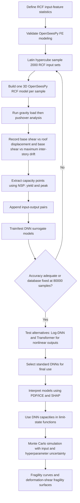

# SUMMARY: Deep learning-based surrogate capacity models and multi-objective fragility estimates for reinforced concrete frames

Source basis: Xing, Gardoni, Song, and Zhou, *Computer Methods in Applied Mechanics and Engineering*, 440, 117928, 2025. This guide is based only on the uploaded paper. Items marked **not reported** are not specified in the paper and should be documented explicitly if you implement them.

---

## 1. Project flowchart



---

## 2. Objective / goal of the paper

The paper builds fast **surrogate capacity models** for reinforced concrete frames (RCFs). Instead of running nonlinear finite-element pushover analysis every time, the authors train deep-learning models to predict key capacity responses directly from geometry and material input features.

The concrete goal is:

1. Generate a large stochastic finite-element database for RCFs.
2. Train neural-network surrogate models to predict yield and peak capacity points.
3. Test whether DNNs, logarithmic-output DNNs, Transformers, or kriging perform best.
4. Use the trained capacity surrogates inside Monte Carlo reliability calculations to estimate fragility curves.
5. Interpret which input features most affect capacity and fragility.

The final conclusion is that the **standard DNNs** were selected for sensitivity analysis and fragility estimates. Log-output DNNs and Transformers were tested for the highly nonlinear deformation outputs, but they did not outperform the standard DNNs.

---

## 3. The “three points” issue: capacity points vs performance point

This is the most important distinction.

### 3.1 Capacity points used for the ML dataset

For every sampled RCF, the authors run a nonlinear static pushover analysis and extract **two capacity points** from the capacity curve:

| Point | Meaning | Output from base shear - roof displacement curve | Output from base shear - maximum inter-story drift curve |
|---|---|---|---|
| Yield point | Idealized onset of yielding | `(Dy, Vy)` | `(IDy, IVy)` |
| Peak / ultimate point | Peak capacity point used as capacity limit | `(Du, Vu)` | `(IDu, IVu)` |

So the ML output database has **eight response quantities**:

```text
[Dy, Vy, Du, Vu, IDy, IVy, IDu, IVu]
```

Where:

- `D` = roof/control-node displacement.
- `V` = base shear associated with the roof-displacement curve.
- `ID` = maximum inter-story drift at a pushover step.
- `IV` = base shear associated with the maximum-inter-story-drift curve.
- `y` = yield.
- `u` = peak / ultimate.

### 3.2 How the yield point is extracted

From the pushover curve, the authors form an idealized force-displacement curve using the nonlinear static procedure (NSP).

The yield point `(Dy, Vy)` is obtained from the first segment of the idealized curve. That first segment has slope equal to the effective lateral stiffness `Ke`. The paper defines the secant stiffness using the origin and a point where the base shear equals `0.6 Vy`. The effective yield strength `Vy` must not exceed the maximum base shear on the actual pushover curve.

For the inter-story-drift version, apply the same idea to the curve:

```text
base shear V vs maximum inter-story drift ID
```

and extract `(IDy, IVy)`.

### 3.3 How the peak / ultimate point is extracted

The peak point `(Du, Vu)` is extracted from the pushover curve using equal energy dissipation: the area under the actual force-displacement curve and the area under the idealized two-segment curve are approximately balanced. The paper also states that `(Du, Vu)` should be on the actual force-displacement curve at the calculated target displacement or at the displacement corresponding to maximum base shear, whichever is least.

For the inter-story-drift curve, the corresponding peak point is `(IDu, IVu)`.

### 3.4 How maximum inter-story drift is obtained

For each pushover step:

1. Compute the inter-story drift for each story.
2. Take the largest absolute inter-story drift among all stories.
3. Pair that maximum drift with the base shear at the same step.
4. Use this `V-ID` curve to extract `(IDy, IVy)` and `(IDu, IVu)`.

This matters because modern seismic performance assessment often uses inter-story drift more directly than roof displacement.

### 3.5 Performance point: used for FE validation, not for training the surrogate models

The performance point is the red star shown in the paper’s validation example. It is computed using the NSP target displacement under a specified earthquake spectrum:

```text
delta_t = C0 C1 C2 Sa Te^2 / (4 pi^2) * g
```

The performance point is:

```text
(delta_t, V_delta_t)
```

Where `delta_t` is the target displacement and `V_delta_t` is the base shear read from the pushover curve at that displacement.

Important replication note: the paper uses the performance point to validate OpenSeesPy against ETABS and SAP2000 for one example frame. The performance point is **not** one of the outputs used to train the DNN surrogate capacity models. The training outputs are the yield and peak capacity points only.

---

## 4. Dataset generation

### 4.1 Validate the FE modeling method first

The paper first validates OpenSeesPy against ETABS and SAP2000.

Validation example frame:

| Item | Value |
|---|---:|
| Plan | square plan |
| Spans | 2 spans in X and Y |
| Span length | 4 m each |
| Number of floors | 6 |
| Story height | 3 m |
| Slab thickness | 120 mm |
| Columns | 400 mm x 400 mm |
| Beams | 200 mm x 500 mm |
| Concrete | C35, `Ec = 3.15e10 Pa` |
| Steel rebar | HRB400, `Es = 2.06e11 Pa` |

The OpenSeesPy model uses:

- displacement-based beam-column elements;
- fiber-discretized sections;
- Concrete02 for confined core concrete;
- Concrete01 for unconfined cover concrete;
- SteelMPF for reinforcing steel;
- constant gravity loads before pushover;
- monotonically increasing lateral loads distributed according to the first mode shape.

The authors compared natural periods, pushover curves, capacity points, and performance points. The first three periods had maximum error below 5%. Comparing OpenSees with SAP2000, the maximum error across the three points and six components was 6.76% for `Vu`, which they considered acceptable for engineering use.

### 4.2 Define input features

The paper uses 29 input features total: 23 sampled variables plus derived/fixed material-parameter groups. The sampled variables are below.

Distribution abbreviations:

```text
U  = uniform
TN = truncated normal
LN = lognormal
```

| # | Feature | Variable | Dist. | Min | Max | Mean | COV |
|---:|---|---|---|---:|---:|---:|---:|
| 1 | Breadth of one span | `B` (m) | U | 3.6 | 10 | 6.8 | 0.272 |
| 2 | Depth of one span | `D` (m) | U | 2.7 | 8.1 | 5.4 | 0.289 |
| 3 | Story height | `H` (m) | U | 3 | 5.4 | 4.2 | 0.165 |
| 4 | Number of spans in breadth direction | `Bnum` | U | 2 | 5 | 3.5 | 0.247 |
| 5 | Number of spans in depth direction | `Dnum` | U | 2 | 5 | 3.5 | 0.247 |
| 6 | Number of stories | `Hnum` | U | 1 | 7 | 4.0 | 0.433 |
| 7 | Column width | `colWidth` (m) | U | 0.3 | 1.2 | 0.75 | 0.346 |
| 8 | Beam depth | `beamDepth` (m) | U | 0.4 | 1.2 | 0.80 | 0.289 |
| 9 | Beam depth-to-width ratio | `beamRat` | U | 0.33 | 0.5 | 0.415 | 0.118 |
| 10 | Steel bar area in column | `Asc` (mm²) | U | 60 | 800 | 430 | 0.497 |
| 11 | Steel bar area in beam | `Asb` (mm²) | U | 60 | 800 | 430 | 0.497 |
| 12 | Slab thickness | `t` (m) | TN | 0.1 | 0.25 | 0.12 | 0.02 |
| 13 | Column cover | `cover1` (m) | TN | 0.02 | 0.05 | 0.04 | 0.05 |
| 14 | Beam cover | `cover2` (m) | TN | 0.02 | 0.05 | 0.04 | 0.05 |
| 15 | Concrete elastic tangent | `Ec` (1e10 Pa) | TN | 3 | 3.6 | 3.15 | 0.15 |
| 16 | Concrete Poisson ratio | `nuc` | U | 0.18 | 0.22 | 0.20 | 0.058 |
| 17 | Concrete compressive strength | `fc` (1e6 Pa) | TN | 14 | 30 | 27 | 0.20 |
| 18 | Ratio of `fcu` to `fc` | `fcuRat` | U | 0.2 | 0.3 | 0.25 | 0.115 |
| 19 | Concrete ultimate strain | `epsilon_cu` | LN | `0.0005 + epsilon_c0` | `0.005 + epsilon_c0` | 0.0033 | 0.20 |
| 20 | Steel elastic tangent | `Es` (1e10 Pa) | LN | 1.9 | 2.2 | 2 | 0.05 |
| 21 | Steel Poisson ratio | `nus` | U | 0.25 | 0.35 | 0.30 | 0.096 |
| 22 | Steel yield strength | `fsy` (1e6 Pa) | LN | 300 | 500 | 400 | 0.08 |
| 23 | Strain-hardening ratio | `eta` | U | 0.008 | 0.04 | 0.024 | 0.384 |

Derived or fixed material parameters listed by the paper:

```text
epsilon_c0 = 2 * fc / Ec
lambda = 0.1
fct = -0.1 * fc
Ecs = fct / 0.002
R0 = 20, cR1 = 0.9215, cR2 = 0.15
a1 = 0.0, a2 = 1.0, a3 = 0.0, a4 = 0.0
```

The authors also state that strongly correlated features were transformed or excluded to avoid impractical/non-compliant configurations.

### 4.3 Sampling procedure

1. Use Latin hypercube sampling.
2. Generate 2,000 initial input sets.
3. Each input set represents one RCF configuration.
4. Build a 3D OpenSeesPy FE model for each input set.
5. Run pushover analysis.
6. Extract yield and peak capacity outputs.
7. Train a DNN and check `R²`.
8. If accuracy is not sufficient, sample another 2,000 input sets, run FE analyses, append the new data, and retrain.
9. Repeat until the final database is reached.

The paper reports 40 updates of 2,000 input-output pairs, giving:

```text
40 x 2000 = 80000 input-output pairs
```

### 4.4 Handling infeasible configurations

The paper explicitly handles unrealistic random samples:

- If the structure is excessively soft and pushover fails to converge or terminates in the initial steps, remove that sample.
- If the structure is overly stiff and the pushover reaches the maximum inter-story drift limit of 2.4%, retain the sample.
- For retained stiff cases without visible softening data, conservatively treat the identified peak point as the capacity limit.

### 4.5 Dataset outputs

For every accepted sample, store:

```text
Inputs: 23 sampled variables + derived/fixed parameters
Outputs from V-D curve:  Dy, Vy, Du, Vu
Outputs from V-ID curve: IDy, IVy, IDu, IVu
```

The final machine-learning task is supervised regression.

### 4.6 Replication warning about the stopping criterion

The paper states that the dataset-building loop stops when `R² > 0.9`. However, the final reported test accuracies for `Du` and `IDu` are below 0.9 even with 80,000 samples. Therefore, to replicate the reported paper, use the reported final size of **80,000 samples**, not a strict stop-only-when-every-output-exceeds-0.9 rule.

---

## 5. Methodology

### 5.1 Finite-element analysis sequence

For each sampled RCF:

1. Construct frame geometry from sampled span dimensions, story height, number of spans, and number of stories.
2. Define beam and column sections.
3. Assign fiber sections with concrete and reinforcement materials.
4. Apply gravity load to establish initial stress state.
5. Compute the first mode shape.
6. Apply monotonically increasing lateral load distributed according to the first mode shape.
7. Continue pushover until large deformation, failure/nonconvergence, or drift limit.
8. Record base shear and roof displacement at every pushover step.
9. Compute maximum absolute inter-story drift at every pushover step.
10. Extract NSP yield and peak points.

### 5.2 Machine learning models used

The paper uses or compares these models:

| Model | Role in the paper |
|---|---|
| Standard DNN | Main surrogate model; selected for final sensitivity and fragility work. |
| Kriging metamodel | Accuracy comparison baseline from optimal tuning kriging. |
| Log-output DNN | Tested for the strongly nonlinear `Du` and `IDu` outputs after transforming outputs to `ln(Du)` and `ln(IDu)`. Did not improve over standard DNN. |
| Transformer | Tested because deformation outputs were highly nonlinear. Did not improve over standard DNN for `Du` and `IDu`. |
| PDP/ICE | Global interpretability, not prediction model. |
| SHAP | Local/model-agnostic interpretability, not prediction model. |

### 5.3 Standard DNN training setup

Reported common setup:

| Item | Reported setting |
|---|---|
| Input features | 23 sampled features |
| Train/test split | 80% / 20% |
| Loss | Mean squared error (MSE) |
| Metric | `R²` |
| Initial learning rate | `1e-5` |
| Maximum epochs | 3,000 |
| Early stopping | 500 steps |
| Batch normalization | Yes |
| Input normalization | The paper says input features were normalized before log-output/Transformer tests; normalization should be used for replication. |
| DNN optimizer | **Not reported** |
| DNN activation function | **Not reported** |
| Random seed | **Not reported** |

### 5.4 Standard DNN architectures and accuracies

The paper’s neuron notation has three entries: neurons in the first two hidden layers, then neurons in the remaining hidden layers.

| Output | Layers | Neurons | Batch size | Weight decay | Dropout | Train R² | Test R² | Kriging test R² |
|---|---:|---|---:|---:|---:|---:|---:|---:|
| `Dy` | 6 | `[128,128,64]` | 128 | 0.4 | 0.20 | 0.922 | 0.901 | 0.812 |
| `Vy` | 6 | `[128,128,64]` | 128 | 0.4 | 0.20 | 0.951 | 0.934 | 0.909 |
| `IDy` | 6 | `[128,128,64]` | 128 | 0.4 | 0.20 | 0.919 | 0.906 | 0.854 |
| `IVy` | 6 | `[128,128,64]` | 128 | 0.1 | 0.20 | 0.944 | 0.931 | 0.900 |
| `Du` | 6 | `[256,128,64]` | 128 | 2.0 | 0.30 | 0.862 | 0.823 | 0.696 |
| `Vu` | 6 | `[128,128,64]` | 256 | 0.4 | 0.15 | 0.978 | 0.969 | 0.940 |
| `IDu` | 6 | `[256,128,64]` | 128 | 1.5 | 0.25 | 0.862 | 0.789 | 0.674 |
| `IVu` | 6 | `[256,128,128]` | 128 | 0.4 | 0.20 | 0.979 | 0.959 | 0.940 |

Interpretation:

- Shear-force outputs (`Vy`, `Vu`, `IVy`, `IVu`) are easier to predict and have test `R² > 0.9`.
- Deformation outputs (`Dy`, `Du`, `IDy`, `IDu`) are more nonlinear.
- `IDu` is the most difficult output.

### 5.5 Dataset-size study

The authors checked how database size affects the two hardest peak deformation outputs.

| Dataset size | `Du` test R² | `IDu` test R² |
|---:|---:|---:|
| 10,000 | 0.770 | 0.703 |
| 20,000 | 0.786 | 0.745 |
| 30,000 | 0.801 | 0.766 |
| 40,000 | 0.820 | 0.786 |
| 80,000 | 0.823 | 0.789 |

Accuracy improves strongly up to about 40,000 samples, then stabilizes. The authors interpret this as diminishing returns from additional samples.

### 5.6 Log-output DNNs for nonlinear outputs

The authors transformed the two difficult outputs:

```text
Du  -> ln(Du)
IDu -> ln(IDu)
```

Then they retrained DNNs.

| Output | Layers | Neurons | Batch size | Weight decay | Dropout | Train R² | Test R² | Standard DNN test R² |
|---|---:|---|---:|---:|---:|---:|---:|---:|
| `Du` | 10 | `[256,128,64]` | 128 | 1.0 | 0.20 | 0.875 | 0.796 | 0.823 |
| `IDu` | 10 | `[128,128,64]` | 128 | 0.4 | 0.20 | 0.842 | 0.785 | 0.789 |

Conclusion: log-output DNNs did not improve over the standard DNNs.

### 5.7 Transformer setup

The authors first tried an 8-output Transformer:

```text
[Dy, Vy, Du, Vu, IDy, IVy, IDu, IVu]
```

That produced large accuracy differences: shear-force outputs had test accuracy above 0.95, while deformation outputs were around 0.75. Because shear-force DNNs were already strong, the authors then trained a 4-output Transformer only for deformation outputs:

```text
[Dy, IDy, Du, IDu]
```

Reported Transformer configuration:

| Item | Setting |
|---|---:|
| Optimizer | AdamW |
| Input features | normalized |
| Initial learning rate | `1e-4` |
| Epochs | 1,000 |
| Batch size | 64 |
| Transformer encoder-decoder layers | 6 |
| Hidden size | 80 |
| Attention heads | 8 |
| Fully connected layers after Transformer | 2 |
| FC activation | ReLU |
| FC neurons | 64 |
| Weight decay | 0.4 |
| Dropout | 0.20 |
| Early stopping | 50 steps |
| Mask | none |
| LR scheduler factor | 0.2 |
| LR scheduler patience | 10 |

Reported Transformer results:

| Output | Transformer train R² | Transformer test R² | Standard DNN test R² |
|---|---:|---:|---:|
| `Du` | 0.857 | 0.800 | 0.823 |
| `IDu` | 0.858 | 0.787 | 0.789 |

Conclusion: the Transformer did not outperform the standard DNNs. The standard DNNs were used for sensitivity analysis and fragility.

### 5.8 Sensitivity analysis

The paper uses:

- PDP and ICE for global interpretation.
- SHAP for local/model-agnostic interpretation.

The four most important features reported for each DNN are:

| Rank | `Dy` | `Vy` | `Du` | `Vu` | `IDy` | `IVy` | `IDu` | `IVu` |
|---:|---|---|---|---|---|---|---|---|
| 1 | colWidth | colWidth | beamDepth | colWidth | colWidth | colWidth | beamDepth | colWidth |
| 2 | beamDepth | beamDepth | Asc | beamDepth | beamDepth | beamDepth | Asc | beamDepth |
| 3 | Asc | Asb | Hnum | Asb | Asc | Asb | fc | Asb |
| 4 | Hnum | Asc | Asb | Bnum | Asb | Asc | colWidth | Bnum |

Main sensitivity interpretation:

- `colWidth` and `beamDepth` tend to reduce deformation capacity but increase shear-force capacity.
- `Asc` and `Asb` tend to increase both deformation and shear-force capacities in the surrogate models.
- The authors caution that using absolute reinforcement area instead of reinforcement ratio limits the ability to capture ductility trade-offs.

---

## 6. Fragility curves

### 6.1 Limit-state function

After training the DNNs, the authors use them as capacity predictors in reliability calculations.

For limit state `k`:

```text
g_k(theta_s, s, Theta) = C_k(theta_s, s, Theta) - D_k(theta_s, s)
```

Where:

- `C_k` = capacity predicted by the trained DNN.
- `D_k` = demand for that failure mode.
- `theta_s` = material and geometrical features.
- `s` = demand variable, such as deformation or base shear.
- `Theta` = DNN hyperparameters.

Failure occurs when:

```text
g_k <= 0
```

Meaning demand is greater than or equal to predicted capacity.

### 6.2 Predictive fragility estimate

The paper defines the frame fragility as the probability of one or more limit-state violations. The predictive fragility estimate integrates over uncertainty in:

1. material/geometrical features `r'`, and
2. DNN hyperparameters `Theta`.

For `Theta`, the authors specifically consider uncertainty in:

```text
weight decay
dropout rate
```

The means are the Table 2 hyperparameter values, and the COV is 20%.

The paper says model error is not introduced as a separate random variable. It is treated implicitly through hyperparameter uncertainty in `Theta`.

### 6.3 Monte Carlo procedure

The paper uses Monte Carlo simulation.

Basic estimator:

```text
Pf = Nf / N
```

or equivalently:

```text
Pf_hat = (1/N) * sum I(x_i, Theta_i)
```

Where:

- `N` = number of Monte Carlo trials.
- `Nf` = number of failed trials.
- `I = 1` if `g <= 0`; otherwise `I = 0`.

The exact Monte Carlo sample size `N` is **not reported** in the paper.

### 6.4 Fragility example-frame setup

For fragility examples, the paper fixes the first six external dimensions:

```text
B = 7 m
D = 5 m
H = 4 m
Bnum = 2
Dnum = 2
Hnum = 4
```

Other features follow the uncertainty distributions in Table 1.

The authors vary three important features from the sensitivity analysis:

| Varied feature | SCH1 | SCH2 | SCH3 | SCH4 |
|---|---:|---:|---:|---:|
| `colWidth` mean | 0.4 m | 0.6 m | 0.8 m | 1.0 m |
| `beamDepth` mean | 0.4 m | 0.6 m | 0.8 m | 1.0 m |
| `Asc` mean | 200 mm² | 400 mm² | 600 mm² | 800 mm² |

When one of these three is varied, the other unfixed features remain uncertain according to Table 1.

### 6.5 How to generate one fragility curve

For a target response, for example `Dy`:

1. Choose a grid of demand values `d`.
2. For each demand value:
   - sample uncertain input features;
   - sample uncertain DNN hyperparameters if following the paper’s fragility uncertainty treatment;
   - compute DNN-predicted capacity `C_Dy`;
   - evaluate `g = C_Dy - d`;
   - count failure if `g <= 0`.
3. Estimate failure probability using `Pf = Nf/N`.
4. Plot `Pf` versus demand `d`.

For a shear output such as `Vy`, use a shear-demand grid `v` and evaluate:

```text
g = C_Vy - v
```

### 6.6 How to generate deformation-shear fragility surfaces

The paper also plots predictive fragility surfaces:

```text
F_tilde(d, v)
```

for paired capacity components:

```text
Dy  - Vy
Du  - Vu
IDy - IVy
IDu - IVu
```

Replication procedure:

1. Define a 2D grid of deformation demand `d` and shear demand `v`.
2. For each grid point, sample uncertain features and hyperparameters.
3. Predict the relevant deformation capacity and shear capacity with the DNNs.
4. Use the paper’s union-of-limit-states notation: failure occurs if any relevant limit state is violated.
5. Estimate probability by Monte Carlo.
6. Plot a contour map of `Pf(d, v)`.

### 6.7 Fragility sensitivity trends reported

The paper reports these fragility-related trends:

| Feature | `Dy` or `IDy` fragility | `Vy` or `IVy` fragility | `Du` or `IDu` fragility | `Vu` or `IVu` fragility |
|---|---|---|---|---|
| `colWidth` | negative | positive | negative | positive |
| `beamDepth` | negative | positive | chaotic | positive |
| `Asc` | positive | positive | positive | positive |

The authors interpret the fragility estimates for deformation failure, especially `Du` and `IDu`, as being strongly affected by structural nonlinearity. Larger column/beam cross-sections reduce shear-failure probability but increase deformation-related fragility probability in their reported results.

---

## 7. Direct replication checklist

Use this as the practical sequence.

### Step A — Implement FE validation

- Build the 6-story validation frame.
- Use OpenSeesPy with fiber beam-column elements.
- Compare natural periods and pushover points against the paper’s reported validation values.
- Do not proceed until the OpenSeesPy model reproduces comparable behavior.

### Step B — Build the stochastic dataset

- Implement Table 1 distributions.
- Use Latin hypercube sampling.
- Generate 2,000 samples per update.
- For each sample, run OpenSeesPy pushover.
- Extract `V-D` and `V-ID` curves.
- Extract yield and peak points using NSP.
- Remove early nonconvergent soft cases.
- Retain stiff cases reaching 2.4% maximum inter-story drift.
- Continue until 80,000 accepted input-output pairs are available.

### Step C — Train DNNs

- Train separate DNN regressors for each output, or reproduce the paper’s output-specific DNN setup.
- Use 80/20 train/test split.
- Use MSE loss and report R².
- Match Table 2 hyperparameters.
- Compare your test R² with the paper’s Table 2.

### Step D — Test nonlinear-output alternatives

- Transform `Du` and `IDu` to logarithms and retrain Log-DNNs.
- Train the 4-output Transformer for `[Dy, IDy, Du, IDu]`.
- Confirm whether the standard DNN still performs best.

### Step E — Sensitivity analysis

- Use PDP/ICE for global feature effects.
- Use SHAP heatmaps for local/model-agnostic feature contributions.
- Verify that `colWidth`, `beamDepth`, `Asc`, and `Asb` dominate as reported.

### Step F — Fragility analysis

- Fix external dimensions to the paper’s example values.
- Use uncertainty distributions for remaining features.
- Include uncertainty in DNN weight decay and dropout with COV 20% if following the paper exactly.
- Generate Monte Carlo samples.
- Predict capacities using trained DNNs.
- Evaluate `g = C - D` for each demand point.
- Estimate `Pf` and plot fragility curves.
- For two-objective fragility, evaluate over a deformation-shear demand grid and plot contour surfaces.

---

## 8. Important limitations to keep in mind

1. The dataset itself is not included in the paper; the paper states data will be made available on request.
2. The exact DNN optimizer, activation function, random seeds, and Monte Carlo trial count are not reported.
3. The FE model focuses on flexural behavior and uses fiber-discretized beam-column elements; the authors note limitations for post-capping softening and localized shear failures.
4. Some sampled configurations may be rare in practice. The authors include them to broaden the design space and test model robustness.
5. The frame designs do not enforce beam-column capacity design principles.
6. The models predict capacity responses; they are not direct design tools by themselves.
7. Demand surrogate models for community-level reliability are described as future/in-progress work, not completed in this paper.
