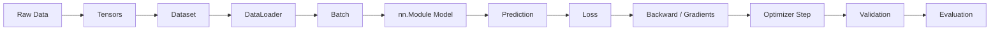

# Neural Networks for Implementation

A neural network is a trainable function.

It receives input data, makes a prediction, compares that prediction with the correct answer using a loss function, and updates its internal parameters so the ne+xt prediction becomes better.

In PyTorch, the whole process usually looks like this:

raw data -> tensors -> Dataset -> DataLoader -> batch -> nn.Module -> prediction -> loss -> gradients -> optimizer step -> validation -> evaluation

This handbook follows that path.

The goal of this vault is to make that path feel concrete. If you have already taken a machine learning course, you probably know the broad ideas: models, features, labels, loss, optimization, training data, validation data, and test data. The difficult part is often not the vocabulary by itself. The difficult part is seeing how those words become working PyTorch code, and knowing where each piece belongs when you are building a real experiment.

In implementation, a neural network is not just an equation. It is a small system made of data preparation, tensor shapes, a model class, a forward pass, a loss function, gradient computation, an optimizer, validation logic, metrics, checkpoints, plots, and experiment notes. Each part is simple enough on its own, but the parts must agree with each other. The input tensor shape must match the first layer. The model output must match the loss function. The target dtype must match the task. The validation loop must avoid gradient updates. The final metric must answer the research question rather than merely repeat the training loss.

This is why the handbook starts with the full learning loop instead of starting with architecture names. Before worrying about larger model families, it is more useful to understand the ordinary supervised-learning pipeline: raw data becomes tensors, tensors become batches, batches pass through an `nn.Module`, predictions become a loss, the loss produces gradients, and the optimizer updates parameters. Once that loop is clear, model-building choices such as activations, hidden layers, weight initialization, regularization, and schedulers become easier to reason about.

## How to read this handbook

Read this vault as a practical narrative, not as a reference manual. The notes are ordered so that each one answers a question raised by the previous one. First, you learn what the neural-network loop is doing. Then you learn how data and shapes enter that loop. Then you build a model class, run the forward pass, compute loss, backpropagate, and update parameters. After that, you separate training from validation, choose evaluation metrics, and begin improving training in disciplined ways.

The examples are intentionally small. That is not because real research code is small, but because small examples make the moving parts visible. A tiny regression model can teach the same implementation pattern as a more complicated model: define inputs, choose the target shape, write the model, choose the loss, train, validate, evaluate, and record the result. Once the pattern is reliable, larger experiments become less mysterious.

The second half of the vault turns the mechanics into a research workflow. It asks how to define a dataset from a problem, why a baseline model should come first, what to record in an experiment log, how to tune hyperparameters without leaking test information, how to compare models fairly, and how to write a reproducible report. These notes are deliberately general. They are meant to support many applied research projects rather than mirror any one paper.

Use the related links at the bottom of each note when you need a nearby concept, and use the glossaries when a term gets in the way of reading. If you are setting up a fresh environment, start with [[01_Minimum_PyTorch_Setup]]. Otherwise, begin with the first concept note and move forward.

## The handbook path

Begin with [[01_The_Neural_Network_Loop]], because every later detail belongs somewhere inside that loop. A neural network receives inputs, produces predictions, measures error with a loss function, computes gradients, and updates its parameters. Once that whole cycle is visible, move into [[02_Tensors_Data_And_Shapes]], where the abstract idea of "data" becomes concrete arrays with shapes and dtypes. From there, [[03_Dataset_Dataloader_Batch_Epoch]] explains how examples are retrieved, grouped into batches, shuffled, and passed through training over repeated epochs.

After the data pipeline is clear, the next step is the model itself. [[04_nnModule_And_Model_Classes]] explains why PyTorch models inherit from `nn.Module`, how layers are registered, and why `model.parameters()` matters. [[05_Forward_Pass]] then follows one batch through the model to produce predictions. Those predictions are not useful by themselves until [[06_Loss_Functions]] shows how to compare them with targets for regression, binary classification, or multiclass classification.

The next part of the path is where learning actually happens. [[07_Backpropagation_Autograd]] explains how `loss.backward()` computes gradients, while [[08_Optimizers]] explains how those gradients become parameter updates. [[09_Training_Loop]] puts the pieces together into the repeated code pattern used during training, and [[10_Validation_Loop]] separates that from validation, where the model is measured without updating parameters. [[11_Evaluation_Metrics]] then broadens the question from "what loss did the model optimize?" to "what result should be reported?"

With the basic training script in place, the handbook turns to model-building choices. [[01_Activation_Functions]] explains why hidden layers need nonlinearities and when sigmoid or softmax should be saved for interpretation rather than training loss. [[02_Regression_Architectures]], [[03_Binary_Classification_Architectures]], and [[04_Multiclass_Classification_Architectures]] show how the final layer, target shape, and loss function change across common supervised tasks. Then [[01_Learning_Rate_And_Schedulers]] and [[05_Weight_Initialization]] show two quiet but important choices that can decide whether training is stable from the beginning.

Once a model can train, the next question is whether it trains well for the right reasons. [[02_Overfitting_Underfitting]] teaches how to read training and validation curves. [[03_Regularization]], [[04_Dropout]], [[05_Batch_Normalization]], and [[06_Skip_Connections]] introduce practical tools for improving training without hiding the basic loop. Finally, [[07_Debugging_Training]] collects the checks that matter when something looks wrong: shapes, dtypes, labels, learning rate, train/eval mode, gradients, leakage, and whether the model can overfit a tiny batch.

The final stretch turns implementation into a research workflow. [[01_From_Problem_To_Dataset]] starts with the research question and translates it into features, targets, splits, and assumptions. [[02_Baseline_Model_First]] argues for simple comparisons before complexity. [[03_Experiment_Tracking]] shows what to record so results remain interpretable, and [[04_Hyperparameter_Tuning]] explains how to search model settings without contaminating the test set. [[05_Model_Comparison]] focuses on fair comparisons, [[06_Error_Analysis]] looks beyond aggregate metrics to inspect failures, and [[07_Reproducible_Report]] closes the loop by showing what belongs in a final experiment report.

By the end of this path, you should be able to read a typical PyTorch training script and identify what each section is responsible for. You should also be able to start a small tabular regression or classification project, debug the first training failures, compare a baseline against a neural network, and explain your results in a reproducible way.

## What this vault is

This vault is a practical handbook for implementing neural networks in PyTorch. It favors explanation with code, tensor shapes, and research habits over long theory sections. Concept notes keep the idea and the PyTorch example together because implementation details are part of the concept, not an afterthought.

It is also intentionally limited in scope. This first version focuses on supervised tabular regression and classification with visible PyTorch training loops. It avoids advanced model families and deployment concerns so the core implementation pattern can become solid before the project expands.
