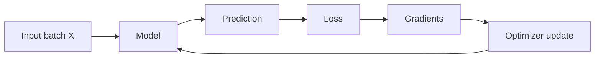

# The Neural Network Loop

## The idea

A neural network learns by repeating a loop: input -> model -> prediction -> loss -> gradients -> update. The model contains parameters, usually weights and biases, that are adjusted during training.

## Why it matters

Most PyTorch bugs happen when one part of this loop is missing, ordered incorrectly, or receiving tensors with the wrong shape or dtype.

## Mental model

The model is a function with adjustable knobs. The loss says how bad the current knob settings are. Backpropagation estimates how each knob should move. The optimizer moves them.



## PyTorch example

```python
import torch
from torch import nn

X = torch.randn(8, 3)
y = torch.randn(8, 1)

model = nn.Linear(3, 1)
loss_fn = nn.MSELoss()
optimizer = torch.optim.SGD(model.parameters(), lr=0.01)

optimizer.zero_grad()
preds = model(X)
loss = loss_fn(preds, y)
loss.backward()
optimizer.step()
```

## Research-style example

```python
def train_one_batch(model, X_batch, y_batch, loss_fn, optimizer, device):
    model.train()
    X_batch = X_batch.to(device)
    y_batch = y_batch.to(device)

    optimizer.zero_grad()
    preds = model(X_batch)
    loss = loss_fn(preds, y_batch)
    loss.backward()
    optimizer.step()

    return loss.item()
```

## Common mistakes

- [ ] Calling `optimizer.step()` before `loss.backward()`.
- [ ] Forgetting `optimizer.zero_grad()`.
- [ ] Comparing predictions and targets with incompatible shapes.
- [ ] Expecting the forward pass alone to update parameters.

## Previous / Next

Previous: [[00_Neural_Networks_Handbook]]
Next: [[02_Tensors_Data_And_Shapes]]
Related: [[07_Backpropagation_Autograd]], [[08_Optimizers]]

