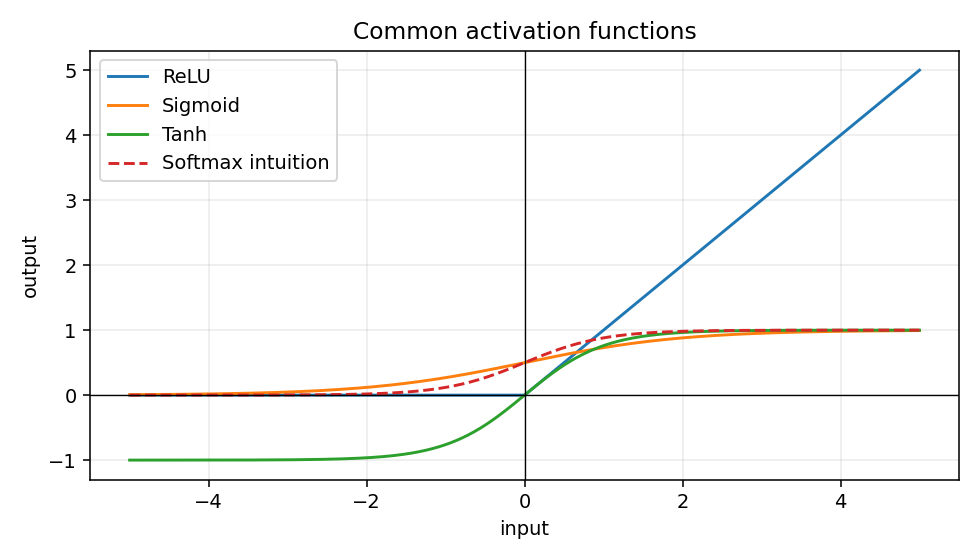

# Activation Functions

## The idea

Activation functions add nonlinearity. Without them, a stack of linear layers behaves like one larger linear layer, which limits what the model can learn. Common activations include ReLU, sigmoid, tanh, and softmax. ([PyTorch docs](https://docs.pytorch.org/docs/stable/nn.html))

## Why it matters

Activations affect gradient flow, output interpretation, and loss choice. For many tabular models, ReLU is a good first hidden-layer activation.

## Mental model



Use sigmoid or softmax for interpretation after training. Do not manually apply sigmoid before `BCEWithLogitsLoss`, and do not manually apply softmax before `CrossEntropyLoss`.

## PyTorch example

```python
import torch
from torch import nn

X = torch.randn(4, 3)
hidden = nn.ReLU()(nn.Linear(3, 8)(X))
print(hidden.shape)  # torch.Size([4, 8])
```

## Research-style example

```python
class MLP(nn.Module):
    def __init__(self, num_features):
        super().__init__()
        self.net = nn.Sequential(
            nn.Linear(num_features, 64),
            nn.ReLU(),
            nn.Linear(64, 32),
            nn.ReLU(),
            nn.Linear(32, 1),
        )

    def forward(self, X):
        return self.net(X)
```

## Common mistakes

- [ ] Putting ReLU after the final regression output.
- [ ] Applying sigmoid before `BCEWithLogitsLoss`.
- [ ] Applying softmax before `CrossEntropyLoss`.
- [ ] Treating logits as probabilities.

## Previous / Next

Previous: [[11_Evaluation_Metrics]]
Next: [[02_Regression_Architectures]]
Related: [[06_Loss_Functions]], [[03_Binary_Classification_Architectures]]

