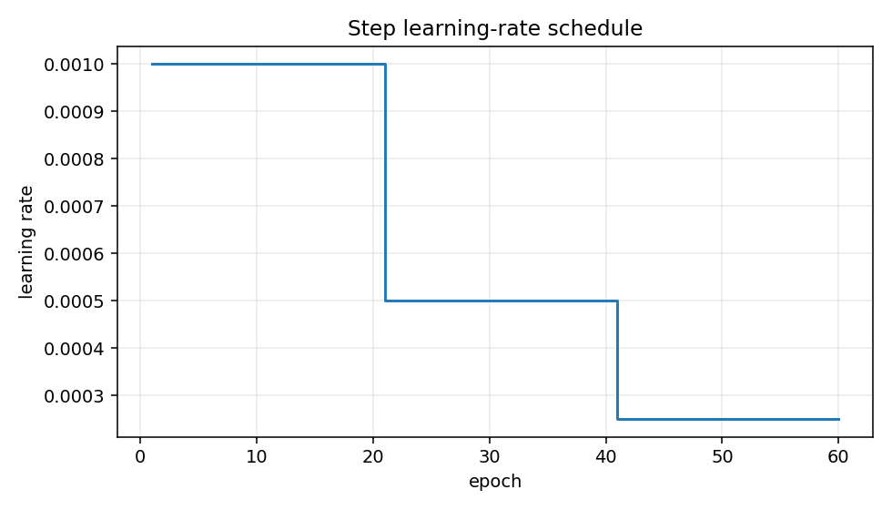

# Learning Rate and Schedulers

## The idea

The learning rate controls how large each optimizer update is. A scheduler changes the learning rate during training.

`ReduceLROnPlateau` lowers the learning rate when a monitored metric stops improving. ([PyTorch docs](https://docs.pytorch.org/docs/stable/generated/torch.optim.lr_scheduler.ReduceLROnPlateau.html))

## Why it matters

Learning rate is often the first hyperparameter to check. If it is too high, loss may jump around or explode. If it is too low, progress may be painfully slow.

## Mental model



## PyTorch example

```python
optimizer = torch.optim.Adam(model.parameters(), lr=1e-3)
scheduler = torch.optim.lr_scheduler.StepLR(optimizer, step_size=20, gamma=0.5)

for epoch in range(num_epochs):
    train_loss = train_one_epoch(model, train_loader, loss_fn, optimizer, device)
    scheduler.step()
```

## Research-style example

```python
optimizer = torch.optim.Adam(model.parameters(), lr=1e-3)
scheduler = torch.optim.lr_scheduler.ReduceLROnPlateau(
    optimizer, mode="min", factor=0.5, patience=5
)

for epoch in range(num_epochs):
    train_loss = train_one_epoch(model, train_loader, loss_fn, optimizer, device)
    val_loss = validate_one_epoch(model, val_loader, loss_fn, device)
    scheduler.step(val_loss)
```

## Common mistakes

- [ ] Calling `ReduceLROnPlateau.step()` without the validation metric.
- [ ] Changing the scheduler before checking the base learning rate.
- [ ] Comparing runs with different schedules without recording them.
- [ ] Expecting a scheduler to fix bad labels or broken shapes.

## Previous / Next

Previous: [[04_Multiclass_Classification_Architectures]]
Next: [[05_Weight_Initialization]]
Related: [[08_Optimizers]], [[04_Hyperparameter_Tuning]]

