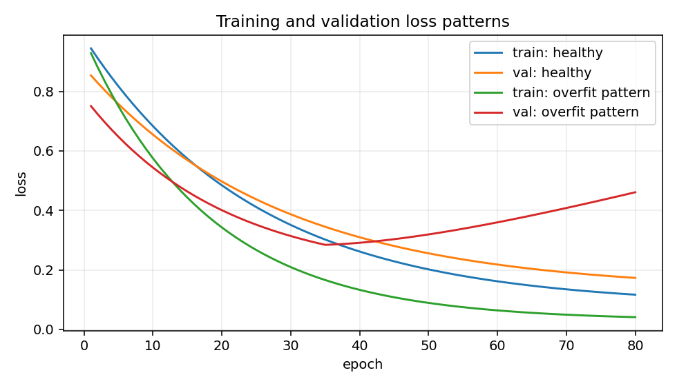

# Overfitting and Underfitting

## The idea

Underfitting means the model is too weak, poorly trained, or poorly specified to learn the pattern. Overfitting means the model fits training data much better than validation data.

## Why it matters

Training curves often tell you what to try next: better features, a larger model, stronger regularization, more data, or a different learning rate.

## Mental model



High bias roughly means the model is too limited. High variance roughly means the model changes too much based on the training set.

## PyTorch example

```python
history = {"train_loss": [], "val_loss": []}

for epoch in range(num_epochs):
    history["train_loss"].append(train_one_epoch(model, train_loader, loss_fn, optimizer, device))
    history["val_loss"].append(validate_one_epoch(model, val_loader, loss_fn, device))
```

## Research-style example

```python
def diagnose_fit(train_loss, val_loss):
    if train_loss[-1] > train_loss[0] * 0.9 and val_loss[-1] > val_loss[0] * 0.9:
        return "possible underfitting or learning-rate issue"
    if val_loss[-1] > min(val_loss) and train_loss[-1] < train_loss[0]:
        return "possible overfitting"
    return "curves look plausible"
```

## Common mistakes

- [ ] Diagnosing overfitting from training loss alone.
- [ ] Using the test set to decide when to stop training.
- [ ] Assuming more layers always improve validation performance.
- [ ] Ignoring data leakage when validation looks too good.

## Previous / Next

Previous: [[05_Weight_Initialization]]
Next: [[03_Regularization]]
Related: [[10_Validation_Loop]], [[07_Debugging_Training]]

