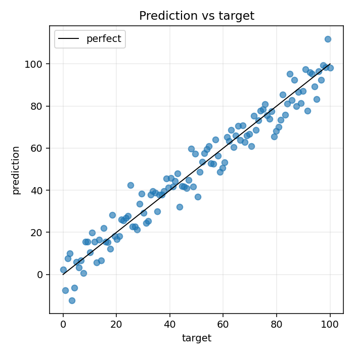

# Error Analysis

## The idea

Error analysis means inspecting where the model fails. For regression, look at high-error samples and residuals. For classification, inspect wrong predictions and confusion patterns.

## Why it matters

Metrics summarize performance, but error analysis explains what kind of performance you have.

## Mental model



```text
aggregate metric -> where are errors concentrated?
individual examples -> what explains those errors?
```

## PyTorch example

```python
with torch.no_grad():
    preds = model(X_test.to(device)).cpu()
errors = (preds - y_test).abs().view(-1)
worst_indices = torch.topk(errors, k=10).indices
```

## Research-style example

```python
def collect_predictions(model, loader, device):
    model.eval()
    all_preds, all_targets = [], []
    with torch.no_grad():
        for X_batch, y_batch in loader:
            preds = model(X_batch.to(device)).cpu()
            all_preds.append(preds)
            all_targets.append(y_batch.cpu())
    return torch.cat(all_preds), torch.cat(all_targets)
```

For classification, a confusion matrix is often the first useful visual. ([scikit-learn docs](https://scikit-learn.org/stable/modules/generated/sklearn.metrics.confusion_matrix.html))

## Common mistakes

- [ ] Looking only at average error.
- [ ] Ignoring subgroups or regimes where the model fails.
- [ ] Treating every high-error sample as a model problem instead of checking data quality.
- [ ] Doing error analysis on training data only.

## Previous / Next

Previous: [[05_Model_Comparison]]
Next: [[07_Reproducible_Report]]
Related: [[Evaluation_Template]], [[11_Evaluation_Metrics]]

