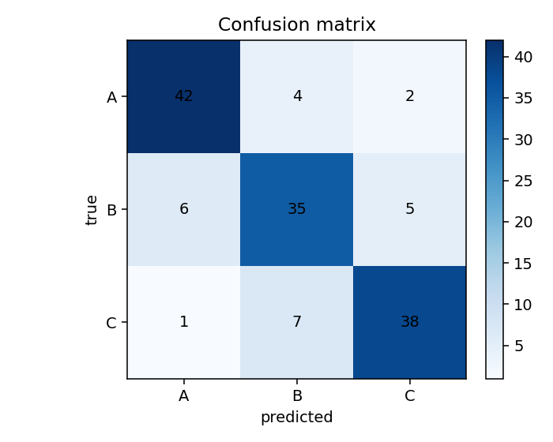

# Evaluation Template

This template collects common regression, binary, and multiclass evaluation patterns.

```python
import torch
import matplotlib.pyplot as plt
from sklearn.metrics import (
    accuracy_score,
    classification_report,
    confusion_matrix,
    mean_absolute_error,
    mean_squared_error,
    r2_score,
)

def collect_outputs(model, loader, device):
    model.eval()
    outputs, targets = [], []
    with torch.no_grad():
        for X_batch, y_batch in loader:
            outputs.append(model(X_batch.to(device)).cpu())
            targets.append(y_batch.cpu())
    return torch.cat(outputs), torch.cat(targets)

def evaluate_regression(model, loader, device):
    preds, targets = collect_outputs(model, loader, device)
    y_pred = preds.numpy()
    y_true = targets.numpy()
    metrics = {
        "mse": mean_squared_error(y_true, y_pred),
        "mae": mean_absolute_error(y_true, y_pred),
        "r2": r2_score(y_true, y_pred),
    }
    plt.scatter(y_true, y_pred, alpha=0.5)
    plt.xlabel("Target")
    plt.ylabel("Prediction")
    plt.show()
    return metrics

def evaluate_binary(model, loader, device, threshold=0.5):
    logits, targets = collect_outputs(model, loader, device)
    probs = torch.sigmoid(logits).view(-1)
    y_pred = (probs >= threshold).long().numpy()
    y_true = targets.view(-1).long().numpy()
    return classification_report(y_true, y_pred, zero_division=0)

def evaluate_multiclass(model, loader, device):
    logits, targets = collect_outputs(model, loader, device)
    y_pred = torch.argmax(logits, dim=1).numpy()
    y_true = targets.numpy()
    return {
        "accuracy": accuracy_score(y_true, y_pred),
        "report": classification_report(y_true, y_pred, zero_division=0),
        "confusion_matrix": confusion_matrix(y_true, y_pred),
    }
```

Example classification diagnostic visual:



Related: [[11_Evaluation_Metrics]], [[06_Error_Analysis]]
