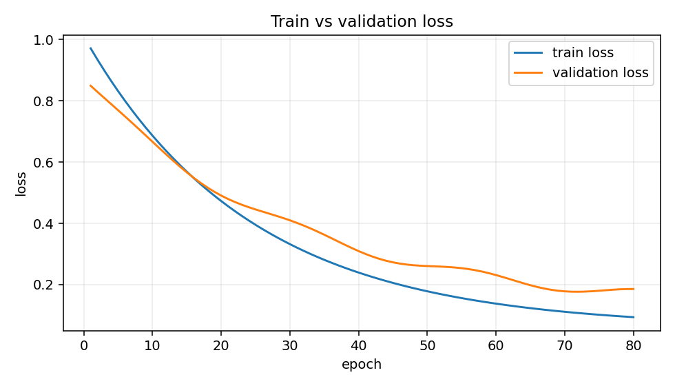

# Training Loop Template

This template keeps the core loop visible.

```python
import torch

def train_one_epoch(model, loader, loss_fn, optimizer, device):
    model.train()
    total_loss = 0.0

    for X_batch, y_batch in loader:
        X_batch = X_batch.to(device)
        y_batch = y_batch.to(device)

        optimizer.zero_grad()
        preds = model(X_batch)
        loss = loss_fn(preds, y_batch)
        loss.backward()
        optimizer.step()

        total_loss += loss.item() * X_batch.size(0)

    return total_loss / len(loader.dataset)

def validate_one_epoch(model, loader, loss_fn, device):
    model.eval()
    total_loss = 0.0

    with torch.no_grad():
        for X_batch, y_batch in loader:
            X_batch = X_batch.to(device)
            y_batch = y_batch.to(device)
            preds = model(X_batch)
            loss = loss_fn(preds, y_batch)
            total_loss += loss.item() * X_batch.size(0)

    return total_loss / len(loader.dataset)

def fit(model, train_loader, val_loader, loss_fn, optimizer, device, num_epochs=100, patience=15):
    history = []
    best_val = float("inf")
    epochs_without_improvement = 0

    for epoch in range(num_epochs):
        train_loss = train_one_epoch(model, train_loader, loss_fn, optimizer, device)
        val_loss = validate_one_epoch(model, val_loader, loss_fn, device)

        history.append({"epoch": epoch + 1, "train_loss": train_loss, "val_loss": val_loss})

        if val_loss < best_val:
            best_val = val_loss
            epochs_without_improvement = 0
            torch.save(model.state_dict(), "best_model.pt")
        else:
            epochs_without_improvement += 1

        if epochs_without_improvement >= patience:
            break

    return history
```

Example training history visual:



Related: [[09_Training_Loop]], [[10_Validation_Loop]]
